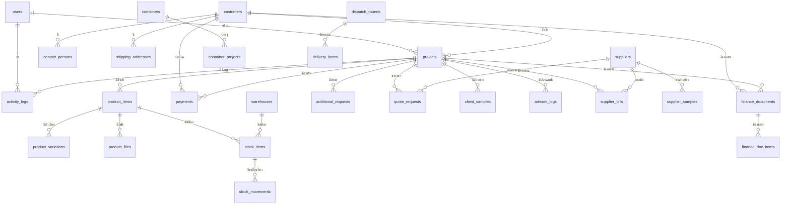

# 🗺️ PPN GREAT — Backend Map ฉบับสมบูรณ์

> **Tech Stack:** Laravel (PHP 8.3) + MySQL + JWT Auth  
> **Hosting:** Hostatom (Plesk) + Shared Hosting  
> **Frontend:** Flutter Web เรียก REST API (JSON)  
> **ระยะเวลา:** 8 วัน (4-11 ก.ค. 2026)

---

## 📌 สารบัญ

1. [สถาปัตยกรรมภาพรวม](#1-สถาปัตยกรรมภาพรวม)
2. [โครงสร้างโปรเจกต์ Laravel](#2-โครงสร้างโปรเจกต์-laravel)
3. [Database Schema ทั้งหมด](#3-database-schema-ทั้งหมด)
4. [API Endpoints แยกรายโมดูล](#4-api-endpoints-แยกรายโมดูล)
5. [ระบบ Auth (JWT)](#5-ระบบ-auth-jwt)
6. [ระบบ File Upload](#6-ระบบ-file-upload)
7. [จุดตายที่ต้องระวัง](#7-จุดตายที่ต้องระวัง)

---

## 1. สถาปัตยกรรมภาพรวม

```
┌─────────────────────┐         ┌──────────────────────────────────┐
│  Flutter Web App    │         │  Hostatom (Plesk)                │
│  (Frontend)         │  HTTP   │                                  │
│                     │ ◄─────► │  Laravel API                     │
│  - Dashboard        │  JSON   │  ├── Routes (api.php)            │
│  - Projects         │         │  ├── Controllers                 │
│  - Customers        │         │  ├── Models (Eloquent)           │
│  - Suppliers        │         │  ├── Middleware (JWT Auth)        │
│  - Finance          │         │  └── Storage (uploads/)          │
│  - Containers       │         │       ├── artworks/              │
│  - Delivery         │         │       ├── slips/                 │
│  - Inventory        │         │       └── documents/             │
│  - Samples          │         │                                  │
│  - Artwork          │         │  MySQL Database                  │
│  - Reports          │         │  ├── ppn_production (ตัวจริง)     │
│                     │         │  └── ppn_staging (ทดสอบ)          │
└─────────────────────┘         └──────────────────────────────────┘
```

### Flow การทำงาน:

```
Flutter App                          Laravel API                        MySQL
─────────                          ───────────                        ─────
1. กด "สร้าง Project"     ──────►  POST /api/projects         ──────► INSERT INTO projects
2. รอ Response            ◄──────  { "id": 1, "status": "ok" } ◄──────  Return ID
3. แสดงผลบนหน้าจอ
```

### API Response Format (มาตรฐานเดียวกันทั้งระบบ):

```json
// ✅ Success
{
    "success": true,
    "data": { ... },
    "message": "สร้างโปรเจกต์สำเร็จ"
}

// ❌ Error
{
    "success": false,
    "error": {
        "code": "VALIDATION_ERROR",
        "message": "กรุณากรอกชื่อลูกค้า"
    }
}

// 📃 List with Pagination
{
    "success": true,
    "data": [ ... ],
    "meta": {
        "current_page": 1,
        "last_page": 5,
        "per_page": 20,
        "total": 100
    }
}
```

---

## 2. โครงสร้างโปรเจกต์ Laravel

```
ppn-api/
├── app/
│   ├── Http/
│   │   ├── Controllers/
│   │   │   ├── AuthController.php           ← Login, Logout, Me
│   │   │   ├── DashboardController.php      ← KPI, Activity
│   │   │   ├── CustomerController.php       ← CRUD ลูกค้า
│   │   │   ├── ContactPersonController.php  ← ผู้ติดต่อของลูกค้า
│   │   │   ├── ProjectController.php        ← CRUD + Pipeline
│   │   │   ├── ProductItemController.php    ← สินค้าใน Project
│   │   │   ├── SupplierController.php       ← CRUD Supplier
│   │   │   ├── QuoteRequestController.php   ← ขอราคา
│   │   │   ├── SupplierSampleController.php ← ตัวอย่างจาก Supplier
│   │   │   ├── SupplierBillController.php   ← AP (จ่ายเงินโรงงาน)
│   │   │   ├── ClientSampleController.php   ← ตัวอย่างส่งลูกค้า
│   │   │   ├── ArtworkController.php        ← Artwork Tracking
│   │   │   ├── FinanceDocController.php     ← QU/PI/DP/CI
│   │   │   ├── PaymentController.php        ← บันทึกรับเงิน
│   │   │   ├── ContainerController.php      ← Container Tracking
│   │   │   ├── DeliveryController.php       ← Dispatch Round
│   │   │   ├── InventoryController.php      ← คลัง + สต็อก
│   │   │   └── ReportController.php         ← Reports
│   │   │
│   │   └── Middleware/
│   │       └── JwtMiddleware.php            ← ตรวจ JWT Token
│   │
│   ├── Models/
│   │   ├── User.php
│   │   ├── Customer.php
│   │   ├── ContactPerson.php
│   │   ├── Project.php
│   │   ├── ProductItem.php
│   │   ├── ProductVariation.php
│   │   ├── ProductFile.php
│   │   ├── AdditionalRequest.php
│   │   ├── Supplier.php
│   │   ├── QuoteRequest.php
│   │   ├── SupplierSample.php
│   │   ├── SupplierBill.php
│   │   ├── ClientSample.php
│   │   ├── ArtworkLog.php
│   │   ├── FinanceDocument.php
│   │   ├── FinanceDocItem.php
│   │   ├── Payment.php
│   │   ├── Container.php
│   │   ├── ContainerTracking.php
│   │   ├── Warehouse.php
│   │   ├── StockItem.php
│   │   ├── StockMovement.php
│   │   ├── DispatchRound.php
│   │   ├── DeliveryItem.php
│   │   └── ActivityLog.php
│   │
│   └── Services/
│       ├── ProjectCodeService.php       ← Auto-generate PPN-001, PPN-002
│       ├── DocNumberService.php         ← Auto-generate QU-2026-0001
│       └── StockService.php             ← ตัดสต็อก (Atomic Transaction)
│
├── database/
│   ├── migrations/
│   │   ├── 001_create_users_table.php
│   │   ├── 002_create_customers_table.php
│   │   ├── 003_create_contact_persons_table.php
│   │   ├── 004_create_projects_table.php
│   │   ├── 005_create_product_items_table.php
│   │   ├── 006_create_suppliers_table.php
│   │   ├── 007_create_quote_requests_table.php
│   │   ├── 008_create_supplier_samples_table.php
│   │   ├── 009_create_supplier_bills_table.php
│   │   ├── 010_create_client_samples_table.php
│   │   ├── 011_create_artwork_logs_table.php
│   │   ├── 012_create_finance_documents_table.php
│   │   ├── 013_create_finance_doc_items_table.php
│   │   ├── 014_create_payments_table.php
│   │   ├── 015_create_containers_table.php
│   │   ├── 016_create_container_tracking_table.php
│   │   ├── 017_create_warehouses_table.php
│   │   ├── 018_create_stock_items_table.php
│   │   ├── 019_create_stock_movements_table.php
│   │   ├── 020_create_dispatch_rounds_table.php
│   │   ├── 021_create_delivery_items_table.php
│   │   ├── 022_create_activity_logs_table.php
│   │   └── 023_create_shipping_addresses_table.php
│   │
│   └── seeders/
│       ├── DatabaseSeeder.php
│       ├── UserSeeder.php
│       └── DummyDataSeeder.php          ← ข้อมูลจำลอง Staging
│
├── routes/
│   └── api.php                          ← API Routes ทั้งหมด
│
├── config/
│   └── jwt.php                          ← JWT Config
│
├── storage/
│   └── app/
│       └── public/
│           ├── artworks/                ← เก็บไฟล์ Artwork
│           ├── slips/                   ← เก็บสลิปโอนเงิน
│           ├── documents/               ← เก็บ PI, Invoice
│           └── samples/                 ← เก็บรูปตัวอย่าง
│
└── .env                                 ← Config DB + JWT Secret
```

---

## 3. Database Schema ทั้งหมด

### 3.1 ตาราง users (ผู้ใช้งานระบบ)

```sql
CREATE TABLE users (
    id BIGINT UNSIGNED AUTO_INCREMENT PRIMARY KEY,
    email VARCHAR(255) NOT NULL UNIQUE,
    password VARCHAR(255) NOT NULL,
    full_name VARCHAR(255) NOT NULL,
    role ENUM('owner','sales','procurement','finance','warehouse','designer','admin') NOT NULL,
    phone VARCHAR(50) NULL,
    is_active TINYINT(1) DEFAULT 1,
    last_login_at TIMESTAMP NULL,
    created_at TIMESTAMP DEFAULT CURRENT_TIMESTAMP,
    updated_at TIMESTAMP DEFAULT CURRENT_TIMESTAMP ON UPDATE CURRENT_TIMESTAMP
);
```

---

### 3.2 ตาราง customers (ลูกค้า)

```sql
CREATE TABLE customers (
    id BIGINT UNSIGNED AUTO_INCREMENT PRIMARY KEY,
    name VARCHAR(255) NOT NULL,
    type ENUM('Enterprise','Mid-Market','SME') DEFAULT 'SME',
    status ENUM('Active','Inactive') DEFAULT 'Active',
    tax_id VARCHAR(20) NULL,
    branch VARCHAR(100) NULL,
    industry VARCHAR(100) NULL,
    lead_source ENUM('Facebook Ads','Google Search','Referral','Exhibition','Direct Contact','Other') NULL,
    internal_note TEXT NULL,
    billing_address TEXT NULL,
    created_by BIGINT UNSIGNED NULL,
    created_at TIMESTAMP DEFAULT CURRENT_TIMESTAMP,
    updated_at TIMESTAMP DEFAULT CURRENT_TIMESTAMP ON UPDATE CURRENT_TIMESTAMP,
    FOREIGN KEY (created_by) REFERENCES users(id) ON DELETE SET NULL
);
```

---

### 3.3 ตาราง contact_persons (ผู้ติดต่อ)

```sql
CREATE TABLE contact_persons (
    id BIGINT UNSIGNED AUTO_INCREMENT PRIMARY KEY,
    customer_id BIGINT UNSIGNED NOT NULL,
    name VARCHAR(255) NOT NULL,
    role VARCHAR(100) NULL,
    phone VARCHAR(50) NULL,
    email VARCHAR(255) NULL,
    line_id VARCHAR(100) NULL,
    other_chat VARCHAR(255) NULL,
    is_primary TINYINT(1) DEFAULT 0,
    created_at TIMESTAMP DEFAULT CURRENT_TIMESTAMP,
    FOREIGN KEY (customer_id) REFERENCES customers(id) ON DELETE CASCADE
);
```

---

### 3.4 ตาราง shipping_addresses (ที่อยู่จัดส่ง)

```sql
CREATE TABLE shipping_addresses (
    id BIGINT UNSIGNED AUTO_INCREMENT PRIMARY KEY,
    customer_id BIGINT UNSIGNED NOT NULL,
    label VARCHAR(255) NOT NULL,
    address TEXT NOT NULL,
    is_default TINYINT(1) DEFAULT 0,
    created_at TIMESTAMP DEFAULT CURRENT_TIMESTAMP,
    FOREIGN KEY (customer_id) REFERENCES customers(id) ON DELETE CASCADE
);
```

---

### 3.5 ตาราง projects (โปรเจกต์)

```sql
CREATE TABLE projects (
    id BIGINT UNSIGNED AUTO_INCREMENT PRIMARY KEY,
    project_code VARCHAR(20) NOT NULL UNIQUE,
    customer_id BIGINT UNSIGNED NOT NULL,
    contact_person_id BIGINT UNSIGNED NULL,
    status ENUM('Inquiry','Sample','Production','Shipping','Distributing','Delivered','Cancelled') DEFAULT 'Inquiry',
    step TINYINT UNSIGNED DEFAULT 0,
    priority TINYINT UNSIGNED DEFAULT 0,
    is_repeat_order TINYINT(1) DEFAULT 0,
    target_date DATE NULL,
    order_value DECIMAL(14,2) DEFAULT 0,
    usage_location TEXT NULL,
    credit_term ENUM('Advance','15 Days','30 Days','45 Days','60 Days') DEFAULT '30 Days',
    deposit_paid TINYINT(1) DEFAULT 0,
    balance_paid TINYINT(1) DEFAULT 0,
    ocpb_passed TINYINT(1) DEFAULT 0,
    shipping_mark_ready TINYINT(1) DEFAULT 0,
    created_by BIGINT UNSIGNED NULL,
    created_at TIMESTAMP DEFAULT CURRENT_TIMESTAMP,
    updated_at TIMESTAMP DEFAULT CURRENT_TIMESTAMP ON UPDATE CURRENT_TIMESTAMP,
    FOREIGN KEY (customer_id) REFERENCES customers(id),
    FOREIGN KEY (contact_person_id) REFERENCES contact_persons(id) ON DELETE SET NULL,
    FOREIGN KEY (created_by) REFERENCES users(id) ON DELETE SET NULL
);
```

---

### 3.6 ตาราง product_items (สินค้าใน Project)

```sql
CREATE TABLE product_items (
    id BIGINT UNSIGNED AUTO_INCREMENT PRIMARY KEY,
    project_id BIGINT UNSIGNED NOT NULL,
    name VARCHAR(255) NOT NULL,
    qty INT UNSIGNED DEFAULT 0,
    specs TEXT NULL,
    target_date DATE NULL,
    created_at TIMESTAMP DEFAULT CURRENT_TIMESTAMP,
    updated_at TIMESTAMP DEFAULT CURRENT_TIMESTAMP ON UPDATE CURRENT_TIMESTAMP,
    FOREIGN KEY (project_id) REFERENCES projects(id) ON DELETE CASCADE
);
```

---

### 3.7 ตาราง product_variations (ตัวเลือกสินค้า)

```sql
CREATE TABLE product_variations (
    id BIGINT UNSIGNED AUTO_INCREMENT PRIMARY KEY,
    product_item_id BIGINT UNSIGNED NOT NULL,
    variation_name VARCHAR(255) NOT NULL,
    created_at TIMESTAMP DEFAULT CURRENT_TIMESTAMP,
    FOREIGN KEY (product_item_id) REFERENCES product_items(id) ON DELETE CASCADE
);
```

---

### 3.8 ตาราง product_files (ไฟล์อ้างอิงสินค้า)

```sql
CREATE TABLE product_files (
    id BIGINT UNSIGNED AUTO_INCREMENT PRIMARY KEY,
    product_item_id BIGINT UNSIGNED NOT NULL,
    file_type ENUM('reference','artwork') DEFAULT 'reference',
    file_name VARCHAR(255) NOT NULL,
    file_path VARCHAR(500) NOT NULL,
    uploaded_at TIMESTAMP DEFAULT CURRENT_TIMESTAMP,
    FOREIGN KEY (product_item_id) REFERENCES product_items(id) ON DELETE CASCADE
);
```

---

### 3.9 ตาราง additional_requests (คำขอเพิ่มเติม)

```sql
CREATE TABLE additional_requests (
    id BIGINT UNSIGNED AUTO_INCREMENT PRIMARY KEY,
    project_id BIGINT UNSIGNED NOT NULL,
    description TEXT NOT NULL,
    cost DECIMAL(12,2) DEFAULT 0,
    created_at TIMESTAMP DEFAULT CURRENT_TIMESTAMP,
    FOREIGN KEY (project_id) REFERENCES projects(id) ON DELETE CASCADE
);
```

---

### 3.10 ตาราง suppliers (ซัพพลายเออร์)

```sql
CREATE TABLE suppliers (
    id BIGINT UNSIGNED AUTO_INCREMENT PRIMARY KEY,
    name VARCHAR(255) NOT NULL,
    category VARCHAR(100) NULL,
    contact_person VARCHAR(255) NULL,
    phone VARCHAR(100) NULL,
    wechat VARCHAR(100) NULL,
    email VARCHAR(255) NULL,
    location VARCHAR(255) NULL,
    rating DECIMAL(2,1) DEFAULT 0,
    notes TEXT NULL,
    is_active TINYINT(1) DEFAULT 1,
    created_at TIMESTAMP DEFAULT CURRENT_TIMESTAMP,
    updated_at TIMESTAMP DEFAULT CURRENT_TIMESTAMP ON UPDATE CURRENT_TIMESTAMP
);
```

---

### 3.11 ตาราง quote_requests (ขอราคาจาก Supplier)

```sql
CREATE TABLE quote_requests (
    id BIGINT UNSIGNED AUTO_INCREMENT PRIMARY KEY,
    supplier_id BIGINT UNSIGNED NOT NULL,
    project_id BIGINT UNSIGNED NOT NULL,
    product_item_id BIGINT UNSIGNED NULL,
    customer_name VARCHAR(255) NULL,
    product_name VARCHAR(255) NOT NULL,
    qty INT UNSIGNED DEFAULT 0,
    specs TEXT NULL,
    variations TEXT NULL,
    target_date DATE NULL,
    packing VARCHAR(255) NULL,
    status ENUM('Waiting Link','Link Sent','Price Filled','Approved') DEFAULT 'Waiting Link',
    quoted_price DECIMAL(12,2) NULL,
    currency ENUM('USD','THB','CNY') DEFAULT 'USD',
    lead_time VARCHAR(100) NULL,
    moq INT UNSIGNED NULL,
    remark TEXT NULL,
    session_token VARCHAR(100) NULL UNIQUE,
    created_at TIMESTAMP DEFAULT CURRENT_TIMESTAMP,
    updated_at TIMESTAMP DEFAULT CURRENT_TIMESTAMP ON UPDATE CURRENT_TIMESTAMP,
    FOREIGN KEY (supplier_id) REFERENCES suppliers(id),
    FOREIGN KEY (project_id) REFERENCES projects(id),
    FOREIGN KEY (product_item_id) REFERENCES product_items(id) ON DELETE SET NULL
);
```

---

### 3.12 ตาราง supplier_samples (ตัวอย่างจาก Supplier)

```sql
CREATE TABLE supplier_samples (
    id BIGINT UNSIGNED AUTO_INCREMENT PRIMARY KEY,
    supplier_id BIGINT UNSIGNED NOT NULL,
    project_id BIGINT UNSIGNED NOT NULL,
    product_name VARCHAR(255) NOT NULL,
    customer_name VARCHAR(255) NULL,
    status ENUM('Waiting Supplier','Sample Sent','Approved') DEFAULT 'Waiting Supplier',
    specs TEXT NULL,
    cost VARCHAR(50) DEFAULT 'TBD',
    tracking_no VARCHAR(100) NULL,
    expected_date DATE NULL,
    created_at TIMESTAMP DEFAULT CURRENT_TIMESTAMP,
    updated_at TIMESTAMP DEFAULT CURRENT_TIMESTAMP ON UPDATE CURRENT_TIMESTAMP,
    FOREIGN KEY (supplier_id) REFERENCES suppliers(id),
    FOREIGN KEY (project_id) REFERENCES projects(id)
);
```

---

### 3.13 ตาราง supplier_bills (AP — บิลจ่าย Supplier)

```sql
CREATE TABLE supplier_bills (
    id BIGINT UNSIGNED AUTO_INCREMENT PRIMARY KEY,
    supplier_id BIGINT UNSIGNED NOT NULL,
    project_id BIGINT UNSIGNED NOT NULL,
    product_name VARCHAR(255) NOT NULL,
    bill_type ENUM('Deposit','Balance','Full Payment') NOT NULL,
    amount_thb DECIMAL(14,2) NOT NULL,
    due_month VARCHAR(20) NULL,
    status ENUM('Pending','Paid','Overdue') DEFAULT 'Pending',
    pi_uploaded TINYINT(1) DEFAULT 0,
    pi_file_path VARCHAR(500) NULL,
    invoice_uploaded TINYINT(1) DEFAULT 0,
    invoice_file_path VARCHAR(500) NULL,
    paid_at TIMESTAMP NULL,
    created_at TIMESTAMP DEFAULT CURRENT_TIMESTAMP,
    updated_at TIMESTAMP DEFAULT CURRENT_TIMESTAMP ON UPDATE CURRENT_TIMESTAMP,
    FOREIGN KEY (supplier_id) REFERENCES suppliers(id),
    FOREIGN KEY (project_id) REFERENCES projects(id)
);
```

---

### 3.14 ตาราง client_samples (ตัวอย่างส่งให้ลูกค้า)

```sql
CREATE TABLE client_samples (
    id BIGINT UNSIGNED AUTO_INCREMENT PRIMARY KEY,
    project_id BIGINT UNSIGNED NOT NULL,
    product_item_id BIGINT UNSIGNED NULL,
    sample_code VARCHAR(20) NOT NULL,
    attempt TINYINT UNSIGNED DEFAULT 1,
    sample_type ENUM('Pre-production Sample','Material Swatch','3D Printed Mockup','Other') DEFAULT 'Pre-production Sample',
    origin ENUM('China','In-Stock') DEFAULT 'China',
    supplier_name VARCHAR(255) NULL,
    status ENUM('Waiting from China','Received from China','Sent to Client','Delivered to Client','Approved','Rejected') DEFAULT 'Waiting from China',
    sent_date DATE NULL,
    china_tracking VARCHAR(100) NULL,
    local_courier VARCHAR(100) NULL,
    local_tracking VARCHAR(100) NULL,
    feedback TEXT NULL,
    created_at TIMESTAMP DEFAULT CURRENT_TIMESTAMP,
    updated_at TIMESTAMP DEFAULT CURRENT_TIMESTAMP ON UPDATE CURRENT_TIMESTAMP,
    FOREIGN KEY (project_id) REFERENCES projects(id),
    FOREIGN KEY (product_item_id) REFERENCES product_items(id) ON DELETE SET NULL
);
```

---

### 3.15 ตาราง artwork_logs (ประวัติ Artwork)

```sql
CREATE TABLE artwork_logs (
    id BIGINT UNSIGNED AUTO_INCREMENT PRIMARY KEY,
    project_id BIGINT UNSIGNED NOT NULL,
    product_item_id BIGINT UNSIGNED NULL,
    artwork_code VARCHAR(20) NOT NULL,
    attempt TINYINT UNSIGNED DEFAULT 1,
    version VARCHAR(50) NOT NULL,
    source ENUM('In-house Designer','Freelance','Customer Provided','Supplier') DEFAULT 'In-house Designer',
    status ENUM('Awaiting Approval','Reviewing','Need Revision','Rejected','Approved by Client','Approved by Supplier') DEFAULT 'Awaiting Approval',
    file_name VARCHAR(255) NULL,
    file_path VARCHAR(500) NULL,
    feedback TEXT NULL,
    uploaded_at TIMESTAMP DEFAULT CURRENT_TIMESTAMP,
    updated_at TIMESTAMP DEFAULT CURRENT_TIMESTAMP ON UPDATE CURRENT_TIMESTAMP,
    FOREIGN KEY (project_id) REFERENCES projects(id),
    FOREIGN KEY (product_item_id) REFERENCES product_items(id) ON DELETE SET NULL
);
```

---

### 3.16 ตาราง finance_documents (เอกสารการเงิน)

```sql
CREATE TABLE finance_documents (
    id BIGINT UNSIGNED AUTO_INCREMENT PRIMARY KEY,
    doc_no VARCHAR(30) NOT NULL UNIQUE,
    project_id BIGINT UNSIGNED NOT NULL,
    customer_id BIGINT UNSIGNED NOT NULL,
    doc_type ENUM('QU','PI','DP','CI') NOT NULL,
    status ENUM('Draft','Sent','Paid','Overdue','Cancelled') DEFAULT 'Draft',
    total_amount DECIMAL(14,2) DEFAULT 0,
    credit_term VARCHAR(50) NULL,
    issue_date DATE NULL,
    due_date DATE NULL,
    notes TEXT NULL,
    created_by BIGINT UNSIGNED NULL,
    created_at TIMESTAMP DEFAULT CURRENT_TIMESTAMP,
    updated_at TIMESTAMP DEFAULT CURRENT_TIMESTAMP ON UPDATE CURRENT_TIMESTAMP,
    FOREIGN KEY (project_id) REFERENCES projects(id),
    FOREIGN KEY (customer_id) REFERENCES customers(id),
    FOREIGN KEY (created_by) REFERENCES users(id) ON DELETE SET NULL
);
```

---

### 3.17 ตาราง finance_doc_items (รายการในเอกสาร)

```sql
CREATE TABLE finance_doc_items (
    id BIGINT UNSIGNED AUTO_INCREMENT PRIMARY KEY,
    finance_document_id BIGINT UNSIGNED NOT NULL,
    item_name VARCHAR(255) NOT NULL,
    qty INT UNSIGNED DEFAULT 1,
    unit_price DECIMAL(12,2) DEFAULT 0,
    total_price DECIMAL(14,2) DEFAULT 0,
    FOREIGN KEY (finance_document_id) REFERENCES finance_documents(id) ON DELETE CASCADE
);
```

---

### 3.18 ตาราง payments (บันทึกรับเงิน — AR)

```sql
CREATE TABLE payments (
    id BIGINT UNSIGNED AUTO_INCREMENT PRIMARY KEY,
    project_id BIGINT UNSIGNED NOT NULL,
    finance_document_id BIGINT UNSIGNED NULL,
    customer_id BIGINT UNSIGNED NOT NULL,
    payment_type ENUM('Deposit','Balance','Full') NOT NULL,
    amount DECIMAL(14,2) NOT NULL,
    method ENUM('Bank Transfer','Cheque','Cash','Other') DEFAULT 'Bank Transfer',
    payment_date DATE NOT NULL,
    status ENUM('Pending Verification','Confirmed') DEFAULT 'Pending Verification',
    slip_file_path VARCHAR(500) NULL,
    verified_by BIGINT UNSIGNED NULL,
    verified_at TIMESTAMP NULL,
    notes TEXT NULL,
    created_at TIMESTAMP DEFAULT CURRENT_TIMESTAMP,
    updated_at TIMESTAMP DEFAULT CURRENT_TIMESTAMP ON UPDATE CURRENT_TIMESTAMP,
    FOREIGN KEY (project_id) REFERENCES projects(id),
    FOREIGN KEY (finance_document_id) REFERENCES finance_documents(id) ON DELETE SET NULL,
    FOREIGN KEY (customer_id) REFERENCES customers(id),
    FOREIGN KEY (verified_by) REFERENCES users(id) ON DELETE SET NULL
);
```

---

### 3.19 ตาราง containers (ตู้ Container)

```sql
CREATE TABLE containers (
    id BIGINT UNSIGNED AUTO_INCREMENT PRIMARY KEY,
    container_code VARCHAR(30) NOT NULL UNIQUE,
    container_no VARCHAR(50) NULL,
    vessel_name VARCHAR(255) NULL,
    port_origin VARCHAR(255) NULL,
    port_destination VARCHAR(255) NULL,
    status ENUM('Factory to Port','Sailing','Port to Warehouse','Delivered') DEFAULT 'Factory to Port',
    -- Step 1: Factory → Port
    factory_departure DATE NULL,
    domestic_tracking VARCHAR(100) NULL,
    port_arrival_china DATE NULL,
    -- Step 2: Sailing
    etd DATE NULL,
    eta DATE NULL,
    actual_arrival DATE NULL,
    -- Step 3: Port → Warehouse
    customs_cleared TINYINT(1) DEFAULT 0,
    customs_date DATE NULL,
    warehouse_arrival DATE NULL,
    notes TEXT NULL,
    created_at TIMESTAMP DEFAULT CURRENT_TIMESTAMP,
    updated_at TIMESTAMP DEFAULT CURRENT_TIMESTAMP ON UPDATE CURRENT_TIMESTAMP
);
```

---

### 3.20 ตาราง container_projects (เชื่อม Container ↔ Projects)

```sql
CREATE TABLE container_projects (
    id BIGINT UNSIGNED AUTO_INCREMENT PRIMARY KEY,
    container_id BIGINT UNSIGNED NOT NULL,
    project_id BIGINT UNSIGNED NOT NULL,
    FOREIGN KEY (container_id) REFERENCES containers(id) ON DELETE CASCADE,
    FOREIGN KEY (project_id) REFERENCES projects(id),
    UNIQUE(container_id, project_id)
);
```

---

### 3.21 ตาราง warehouses (คลังสินค้า)

```sql
CREATE TABLE warehouses (
    id BIGINT UNSIGNED AUTO_INCREMENT PRIMARY KEY,
    name VARCHAR(255) NOT NULL,
    location TEXT NULL,
    is_active TINYINT(1) DEFAULT 1,
    created_at TIMESTAMP DEFAULT CURRENT_TIMESTAMP
);
```

---

### 3.22 ตาราง stock_items (สต็อกสินค้า)

```sql
CREATE TABLE stock_items (
    id BIGINT UNSIGNED AUTO_INCREMENT PRIMARY KEY,
    warehouse_id BIGINT UNSIGNED NOT NULL,
    product_item_id BIGINT UNSIGNED NOT NULL,
    project_id BIGINT UNSIGNED NOT NULL,
    qty_in_stock INT DEFAULT 0,
    qty_reserved INT DEFAULT 0,
    location_in_warehouse VARCHAR(100) NULL,
    last_received_at TIMESTAMP NULL,
    created_at TIMESTAMP DEFAULT CURRENT_TIMESTAMP,
    updated_at TIMESTAMP DEFAULT CURRENT_TIMESTAMP ON UPDATE CURRENT_TIMESTAMP,
    FOREIGN KEY (warehouse_id) REFERENCES warehouses(id),
    FOREIGN KEY (product_item_id) REFERENCES product_items(id),
    FOREIGN KEY (project_id) REFERENCES projects(id)
);
```

---

### 3.23 ตาราง stock_movements (ประวัติเคลื่อนไหวสต็อก)

```sql
CREATE TABLE stock_movements (
    id BIGINT UNSIGNED AUTO_INCREMENT PRIMARY KEY,
    stock_item_id BIGINT UNSIGNED NOT NULL,
    movement_type ENUM('IN','OUT','ADJUST') NOT NULL,
    qty INT NOT NULL,
    reference_type VARCHAR(50) NULL,
    reference_id BIGINT UNSIGNED NULL,
    notes TEXT NULL,
    created_by BIGINT UNSIGNED NULL,
    created_at TIMESTAMP DEFAULT CURRENT_TIMESTAMP,
    FOREIGN KEY (stock_item_id) REFERENCES stock_items(id),
    FOREIGN KEY (created_by) REFERENCES users(id) ON DELETE SET NULL
);
```

---

### 3.24 ตาราง dispatch_rounds (รอบส่ง)

```sql
CREATE TABLE dispatch_rounds (
    id BIGINT UNSIGNED AUTO_INCREMENT PRIMARY KEY,
    dispatch_code VARCHAR(20) NOT NULL UNIQUE,
    dispatch_date DATE NOT NULL,
    driver_name VARCHAR(255) NULL,
    vehicle_plate VARCHAR(50) NULL,
    status ENUM('Scheduled','In Transit','Delivered') DEFAULT 'Scheduled',
    notes TEXT NULL,
    created_by BIGINT UNSIGNED NULL,
    created_at TIMESTAMP DEFAULT CURRENT_TIMESTAMP,
    updated_at TIMESTAMP DEFAULT CURRENT_TIMESTAMP ON UPDATE CURRENT_TIMESTAMP,
    FOREIGN KEY (created_by) REFERENCES users(id) ON DELETE SET NULL
);
```

---

### 3.25 ตาราง delivery_items (รายการสินค้าในรอบส่ง)

```sql
CREATE TABLE delivery_items (
    id BIGINT UNSIGNED AUTO_INCREMENT PRIMARY KEY,
    dispatch_round_id BIGINT UNSIGNED NOT NULL,
    project_id BIGINT UNSIGNED NOT NULL,
    product_item_id BIGINT UNSIGNED NULL,
    customer_name VARCHAR(255) NULL,
    delivery_address TEXT NULL,
    qty_to_deliver INT UNSIGNED DEFAULT 0,
    warehouse_id BIGINT UNSIGNED NULL,
    notes TEXT NULL,
    FOREIGN KEY (dispatch_round_id) REFERENCES dispatch_rounds(id) ON DELETE CASCADE,
    FOREIGN KEY (project_id) REFERENCES projects(id),
    FOREIGN KEY (product_item_id) REFERENCES product_items(id) ON DELETE SET NULL,
    FOREIGN KEY (warehouse_id) REFERENCES warehouses(id) ON DELETE SET NULL
);
```

---

### 3.26 ตาราง activity_logs (บันทึกกิจกรรม)

```sql
CREATE TABLE activity_logs (
    id BIGINT UNSIGNED AUTO_INCREMENT PRIMARY KEY,
    user_id BIGINT UNSIGNED NULL,
    project_id BIGINT UNSIGNED NULL,
    action VARCHAR(255) NOT NULL,
    description TEXT NULL,
    entity_type VARCHAR(50) NULL,
    entity_id BIGINT UNSIGNED NULL,
    created_at TIMESTAMP DEFAULT CURRENT_TIMESTAMP,
    FOREIGN KEY (user_id) REFERENCES users(id) ON DELETE SET NULL,
    FOREIGN KEY (project_id) REFERENCES projects(id) ON DELETE SET NULL
);
```

---

### 📊 ER Diagram (ความสัมพันธ์)



---

## 4. API Endpoints แยกรายโมดูล

### 4.1 Auth (3 endpoints)

```
POST   /api/auth/login              → LoginRequest: {email, password}
POST   /api/auth/logout             → Header: Authorization Bearer {token}
GET    /api/auth/me                 → ดึงข้อมูล User ปัจจุบัน
```

### 4.2 Dashboard (3 endpoints)

```
GET    /api/dashboard/summary       → KPI Cards (active projects, pending orders, revenue MTD, pending payments)
GET    /api/dashboard/activities    → Activity Log ล่าสุด 20 รายการ
GET    /api/dashboard/revenue-chart → Revenue by month (12 เดือนล่าสุด)
```

### 4.3 Customers (9 endpoints)

```
GET    /api/customers               → List ลูกค้า (?search=&status=&type=&page=)
GET    /api/customers/{id}          → รายละเอียดลูกค้า (include: contacts, addresses, stats, projects)
POST   /api/customers               → สร้างลูกค้าใหม่
PUT    /api/customers/{id}          → แก้ไขลูกค้า
POST   /api/customers/{id}/contacts          → เพิ่มผู้ติดต่อ
PUT    /api/customers/{id}/contacts/{cid}    → แก้ไขผู้ติดต่อ
DELETE /api/customers/{id}/contacts/{cid}    → ลบผู้ติดต่อ
POST   /api/customers/{id}/addresses         → เพิ่มที่อยู่
GET    /api/customers/{id}/stats             → สถิติลูกค้า
```

### 4.4 Projects (9 endpoints)

```
GET    /api/projects                → List Project (?status=&search=&sort=target_date&page=)
GET    /api/projects/{id}           → รายละเอียด Project (include: products, finance, compliance, logs)
POST   /api/projects                → สร้าง Project + Products
PUT    /api/projects/{id}           → แก้ไข Project
PATCH  /api/projects/{id}/status    → อัปเดตสถานะ (เลื่อน Step)
POST   /api/projects/{id}/products              → เพิ่มสินค้า
PUT    /api/projects/{id}/products/{pid}         → แก้ไขสินค้า
POST   /api/projects/{id}/additional-requests    → เพิ่มคำขอพิเศษ
GET    /api/projects/{id}/logs                   → Activity Log ของ Project
```

### 4.5 Suppliers (4 endpoints)

```
GET    /api/suppliers               → List Supplier (?search=&category=)
GET    /api/suppliers/{id}          → รายละเอียด (include: quotes, samples, bills)
POST   /api/suppliers               → เพิ่ม Supplier
PUT    /api/suppliers/{id}          → แก้ไข Supplier
```

### 4.6 Quote Requests (5 endpoints)

```
GET    /api/suppliers/{id}/quotes              → List ใบขอราคา
POST   /api/suppliers/{id}/quotes              → สร้างใบขอราคา
PUT    /api/suppliers/{id}/quotes/{qid}        → แก้ไข/อัปเดตราคา
PATCH  /api/suppliers/{id}/quotes/{qid}/status → อัปเดตสถานะ
POST   /api/suppliers/{id}/quotes/{qid}/generate-link → สร้าง Session Link
```

### 4.7 Supplier Samples (4 endpoints)

```
GET    /api/suppliers/{id}/samples             → List ตัวอย่าง
POST   /api/suppliers/{id}/samples             → ขอตัวอย่าง
PUT    /api/suppliers/{id}/samples/{sid}       → แก้ไข
PATCH  /api/suppliers/{id}/samples/{sid}/status → อัปเดตสถานะ
```

### 4.8 Supplier Bills - AP (4 endpoints)

```
GET    /api/suppliers/{id}/bills               → List บิล
POST   /api/suppliers/{id}/bills               → สร้างบิล
PATCH  /api/suppliers/{id}/bills/{bid}/pay     → จ่ายเงิน
POST   /api/suppliers/{id}/bills/{bid}/upload  → อัปโหลดเอกสาร (PI/Invoice)
```

### 4.9 Client Samples (5 endpoints)

```
GET    /api/samples                            → List Project ที่มี Sample
GET    /api/samples/project/{pid}              → Sample ทั้งหมดของ Project
POST   /api/samples                            → สร้าง Sample ใหม่
PUT    /api/samples/{id}                       → แก้ไข
PATCH  /api/samples/{id}/status                → อัปเดตสถานะ + Tracking
```

### 4.10 Artwork (6 endpoints)

```
GET    /api/artworks                           → List Project ที่มี Artwork
GET    /api/artworks/project/{pid}             → Artwork ทั้งหมดของ Project
POST   /api/artworks                           → เพิ่ม Artwork Log + Upload File
PUT    /api/artworks/{id}                      → แก้ไข
PATCH  /api/artworks/{id}/status               → อัปเดตสถานะ
PATCH  /api/artworks/{id}/feedback             → อัปเดต Feedback
```

### 4.11 Finance Documents (6 endpoints)

```
GET    /api/finance/documents                  → List เอกสาร (?type=QU&status=Draft&page=)
GET    /api/finance/documents/{id}             → รายละเอียด (include: items)
POST   /api/finance/documents                  → สร้างเอกสาร (auto doc_no)
PUT    /api/finance/documents/{id}             → แก้ไข
PATCH  /api/finance/documents/{id}/status      → อัปเดตสถานะ
POST   /api/finance/documents/{id}/pdf         → สร้าง PDF (Phase ถัดไป)
```

### 4.12 Payments - AR (4 endpoints)

```
GET    /api/finance/payments                   → List รายการรับเงิน
POST   /api/finance/payments                   → บันทึกรับเงิน + Upload สลิป
PATCH  /api/finance/payments/{id}/verify       → ยืนยันรับเงิน
POST   /api/finance/payments/{id}/upload-slip  → อัปโหลดสลิป
```

### 4.13 Containers (5 endpoints)

```
GET    /api/containers                         → List Container (?status=)
GET    /api/containers/{id}                    → รายละเอียด (include: projects)
POST   /api/containers                         → สร้าง Container + เชื่อม Projects
PUT    /api/containers/{id}                    → แก้ไข
PATCH  /api/containers/{id}/step               → อัปเดตขั้นตอน
```

### 4.14 Inventory (5 endpoints)

```
GET    /api/inventory/warehouses               → List คลัง
GET    /api/inventory/warehouses/{id}/stocks   → สต็อกในคลัง (?search=)
POST   /api/inventory/receive                  → รับสินค้าเข้าคลัง
GET    /api/inventory/movements                → ประวัติเคลื่อนไหว
GET    /api/inventory/low-stock                → สินค้าใกล้หมด
```

### 4.15 Delivery (5 endpoints)

```
GET    /api/delivery/rounds                    → List รอบส่ง
GET    /api/delivery/rounds/{id}               → รายละเอียด (include: items)
POST   /api/delivery/rounds                    → สร้างรอบส่ง + Items
PATCH  /api/delivery/rounds/{id}/confirm       → ยืนยัน → ตัดสต็อก (Transaction!)
PATCH  /api/delivery/rounds/{id}/complete      → ส่งเสร็จ
```

### 4.16 Reports (4 endpoints)

```
GET    /api/reports/financial-summary          → สรุปการเงิน
GET    /api/reports/operational-summary        → สรุปปฏิบัติการ
GET    /api/reports/revenue-by-month           → รายได้รายเดือน
GET    /api/reports/profit-by-project          → กำไรรายโปรเจกต์
```

### 📊 สรุปจำนวน Endpoints

| โมดูล | จำนวน |
|--------|-------|
| Auth | 3 |
| Dashboard | 3 |
| Customers | 9 |
| Projects | 9 |
| Suppliers | 4 |
| Quotes | 5 |
| Supplier Samples | 4 |
| Supplier Bills | 4 |
| Client Samples | 5 |
| Artwork | 6 |
| Finance Docs | 6 |
| Payments | 4 |
| Containers | 5 |
| Inventory | 5 |
| Delivery | 5 |
| Reports | 4 |
| **รวม** | **~81 endpoints** |

---

## 5. ระบบ Auth (JWT)

### Flow:

```
1. Flutter ส่ง POST /api/auth/login {email, password}
2. Laravel ตรวจรหัส → ถูกต้อง → สร้าง JWT Token → ส่งกลับ
3. Flutter เก็บ Token ไว้
4. ทุกครั้งที่เรียก API → ส่ง Header: Authorization: Bearer {token}
5. Laravel Middleware ตรวจ Token → ถูกต้อง → ให้ผ่าน / ไม่ถูก → 401
```

### Package: `tymon/jwt-auth`

```bash
composer require tymon/jwt-auth
php artisan jwt:secret
```

---

## 6. ระบบ File Upload

### เก็บไฟล์บน Hosting (Hostatom):

```
storage/app/public/
├── artworks/          ← ไฟล์ Artwork (jpg, png, pdf, ai)
│   └── {project_id}/
│       └── ART-001_V1.png
├── slips/             ← สลิปโอนเงิน
│   └── PAY-001_slip.jpg
├── documents/         ← เอกสาร PI, Invoice
│   └── {supplier_id}/
│       └── BILL-001_pi.pdf
└── samples/           ← รูปตัวอย่างสินค้า
    └── {project_id}/
        └── CS-001.jpg
```

### ข้อจำกัด Hostatom:
- แพลน Go = 10 GB SSD → เก็บไฟล์ได้ประมาณ 5-7 GB (หลังหัก OS + App)
- ถ้าใกล้เต็ม → ย้ายไฟล์เก่าไปเก็บ Cloud (ตามที่คุยกับหัวหน้า)

---

## 7. จุดตายที่ต้องระวัง

### 🔴 จุดตาย #1: Delivery ตัดสต็อก (Atomic Transaction)

```php
// ❌ ห้ามทำแบบนี้ (ไม่ปลอดภัย)
$stock->qty -= $deliveryQty;  // ตัดสต็อก
$stock->save();
$delivery->status = 'delivered'; // อัปเดตสถานะ
$delivery->save();
// ถ้า save ตัวที่ 2 พัง → สต็อกตัดแล้ว แต่ Delivery ไม่สำเร็จ!

// ✅ ต้องทำแบบนี้ (Atomic Transaction)
DB::transaction(function () use ($dispatch) {
    foreach ($dispatch->items as $item) {
        $stock = StockItem::where('product_item_id', $item->product_item_id)->first();
        if ($stock->qty_in_stock < $item->qty_to_deliver) {
            throw new Exception("สต็อกไม่พอ!");
        }
        $stock->decrement('qty_in_stock', $item->qty_to_deliver);

        StockMovement::create([
            'stock_item_id' => $stock->id,
            'movement_type' => 'OUT',
            'qty' => $item->qty_to_deliver,
            'reference_type' => 'dispatch_round',
            'reference_id' => $dispatch->id,
        ]);
    }
    $dispatch->status = 'In Transit';
    $dispatch->save();
});
// ถ้าอะไรพัง → ทั้งหมดจะ Rollback (กลับสู่สถานะเดิม)
```

### 🔴 จุดตาย #2: Auto-generate เลขเอกสาร

```php
// Service: DocNumberService.php
class DocNumberService
{
    public static function generate(string $type): string
    {
        $year = date('Y');
        $prefix = $type; // QU, PI, DP, CI

        $lastDoc = FinanceDocument::where('doc_type', $type)
            ->whereYear('created_at', $year)
            ->orderBy('id', 'desc')
            ->first();

        $nextNumber = $lastDoc
            ? intval(substr($lastDoc->doc_no, -4)) + 1
            : 1;

        return sprintf('%s-%s-%04d', $prefix, $year, $nextNumber);
        // ผลลัพธ์: QU-2026-0001, QU-2026-0002, PI-2026-0001 ...
    }
}
```

### 🔴 จุดตาย #3: Credit Term คำนวณ Due Date

```php
// เมื่อสร้าง Finance Document
$issueDate = Carbon::parse($request->issue_date);
$creditTerm = $project->credit_term; // "30 Days"

$dueDate = match($creditTerm) {
    'Advance' => $issueDate,
    '15 Days' => $issueDate->addDays(15),
    '30 Days' => $issueDate->addDays(30),
    '45 Days' => $issueDate->addDays(45),
    '60 Days' => $issueDate->addDays(60),
};
```

### 🔴 จุดตาย #4: CORS (Flutter Web เรียก API ข้าม Domain)

```php
// ต้องตั้งค่าใน Laravel เพื่อให้ Flutter Web เรียกได้
// config/cors.php
'paths' => ['api/*'],
'allowed_origins' => ['*'], // Production ต้องระบุ Domain จริง
'allowed_methods' => ['*'],
'allowed_headers' => ['*'],
```

### 🟡 จุดตาย #5: Multi-currency (THB / USD / CNY)

```
- ราคา Supplier เป็น USD หรือ CNY
- ราคาขายลูกค้าเป็น THB
- ตอนนี้: เก็บอัตราแลกเปลี่ยนเป็น Field ในตาราง (ไม่ต้อง Real-time)
- อนาคต: ใช้ API อัตราแลกเปลี่ยนอัตโนมัติ
```

---

> 📝 **สร้างโดย:** Antigravity AI Assistant  
> **วันที่:** 3 กรกฎาคม 2026
