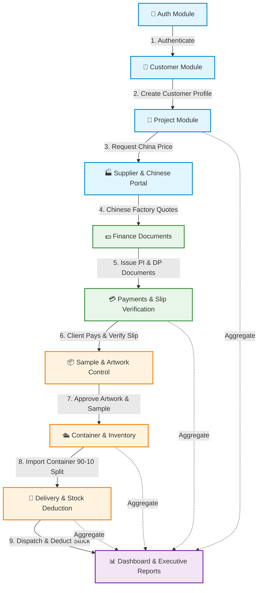

# 📖 PPN GREAT — คู่มือสารบัญและแผนภาพการทำงานของ API ทั้งระบบ (Complete API Directory & Architecture Guide)

คู่มือฉบับนี้จัดทำขึ้นเพื่ออธิบายการทำงานของ **API ทุกเส้น** ในระบบ PPN GREAT (รวมทั้งหมด 73 Endpoints) แยกตามแต่ละโมดูลอย่างละเอียด พร้อมแผนภาพ **Mermaid Diagram** แสดงสถาปัตยกรรมความสัมพันธ์และการไหลเวียนข้อมูล (Data Flow) ของระบบ

---

## 🎨 1. แผนภาพแสดงสถาปัตยกรรมและการไหลเวียนข้อมูล (Mermaid Diagram)

---

## 📂 2. สารบัญรายละเอียด API ทั้งหมดแยกตามโมดูลหลัก (73 Endpoints)

ทุกๆ API ที่ต้องเข้าสู่ระบบ จะต้องส่ง Header ต่อไปนี้ไปด้วยเสมอ:
*   `Authorization`: `Bearer <JWT_TOKEN>`
*   `Accept`: `application/json`

---

### 🔑 1. โมดูลยืนยันสิทธิ์ผู้ใช้งาน (Auth & Account Module) — 3 Endpoints
ทำหน้าที่เกี่ยวกับการล็อกอิน การดึงโปรไฟล์พนักงาน และการออกจากระบบ

| # | Method | URL Path | คำอธิบายหน้าที่การทำงาน | Request Body (JSON) / Notes |
|---|--------|----------|-----------------------|-----------------------------|
| 1 | `POST` | `/api/auth/login` | เข้าสู่ระบบพนักงาน | `{"email": "...", "password": "..."}` |
| 2 | `POST` | `/api/auth/logout` | ออกจากระบบ (ทำลาย Token ปัจจุบัน) | *(ไม่ต้องส่ง Body)* |
| 3 | `GET` | `/api/auth/me` | ดึงข้อมูลโปรไฟล์พนักงานที่ล็อกอินอยู่ | *(ดูบทบาทและข้อมูลผู้ใช้ปัจจุบัน)* |

---

### 👥 2. โมดูลจัดการข้อมูลลูกค้า (Customer Management Module) — 8 Endpoints
จัดการข้อมูลประวัติลูกค้าบริษัทไทย ที่อยู่การจัดส่งสินค้า และรายชื่อผู้ติดต่อหลัก

| # | Method | URL Path | คำอธิบายหน้าที่การทำงาน | Request Body (JSON) / Notes |
|---|--------|----------|-----------------------|-----------------------------|
| 4 | `GET` | `/api/customers` | ดึงรายชื่อลูกค้าไทยทั้งหมด | รองรับพารามิเตอร์ `search` และการแบ่งหน้า |
| 5 | `GET` | `/api/customers/{id}` | ดึงข้อมูลลูกค้ารายบุคคลอย่างละเอียด | *(ดึงประวัติและที่อยู่จัดส่งเชื่อมโยง)* |
| 6 | `POST` | `/api/customers` | บันทึกประวัติลูกค้าบริษัทใหม่ | `{"name": "...", "type": "...", "tax_id": "..."}` |
| 7 | `PUT` | `/api/customers/{id}` | อัปเดตข้อมูลลูกค้าเดิม | `{"name": "...", "phone": "..."}` |
| 8 | `POST` | `/api/customers/{id}/contacts` | เพิ่มรายชื่อผู้ติดต่อของลูกค้า | `{"name": "...", "position": "...", "is_primary": true}` |
| 9 | `PUT` | `/api/customers/{id}/contacts/{cid}` | อัปเดตข้อมูลผู้ติดต่อ | `{"name": "...", "phone": "..."}` |
| 10| `DELETE`| `/api/customers/{id}/contacts/{cid}`| ลบรายชื่อผู้ติดต่อที่ไม่ใช้งานแล้ว | *(ลบออกจากฐานข้อมูล)* |
| 11| `POST` | `/api/customers/{id}/addresses` | เพิ่มที่อยู่จัดส่งสินค้าใหม่ของลูกค้า | `{"recipient_name": "...", "province": "..."}` |

---

### 📂 3. โมดูลโครงการสินค้าพรีเมียม (Project Management Module) — 9 Endpoints
บริหารโปรเจกต์งานนำเข้าสินค้าพรีเมียม การระบุสเปกสินค้า และบันทึกประวัติการเปลี่ยนแปลงโครงการ

| # | Method | URL Path | คำอธิบายหน้าที่การทำงาน | Request Body (JSON) / Notes |
|---|--------|----------|-----------------------|-----------------------------|
| 12| `GET` | `/api/projects` | ดึงรายชื่อโครงการทั้งหมด | รองรับการกรองตามสถานะและเสิร์ช |
| 13| `GET` | `/api/projects/{id}` | ดึงรายละเอียดโครงการหนึ่งตัว | *(รวมข้อมูลสินค้าในโครงการและประวัติ)* |
| 14| `POST` | `/api/projects` | สร้างโครงการใหม่ (รันเลข `PPN-XXX` อัตโนมัติ)| `{"customer_id": 1, "name": "..."}` |
| 15| `PUT` | `/api/projects/{id}` | อัปเดตข้อมูลรายละเอียดโครงการ | `{"name": "...", "special_instructions": "..."}` |
| 16| `PATCH`| `/api/projects/{id}/status` | อัปเดตขั้นตอนโครงการ (Pipeline Status) | `{"status": "Sample"}` (มีสเตตัส 9 ระดับ) |
| 17| `POST` | `/api/projects/{id}/products` | เพิ่มรายการสินค้าพรีเมียมเข้าโครงการ | `{"name": "...", "qty": 5000, "specs": "..."}` |
| 18| `PUT` | `/api/projects/{id}/products/{pid}` | อัปเดตข้อมูลสินค้าในโครงการ | `{"specs": "...", "qty": 1000}` |
| 19| `POST` | `/api/projects/{id}/additional-requests` | เพิ่มคำร้องขอเพิ่มเติมของลูกค้าไทย | `{"request_type": "...", "description": "..."}` |
| 20| `GET` | `/api/projects/{id}/logs` | ดึงประวัติกิจกรรมการแก้ไขโครงการย้อนหลัง | แสดงประวัติการบันทึก Log การอัปเดตสเตตัส |

---

### 🏭 4. โมดูลซัพพลายเออร์และพอร์ทัลเสนอราคาจีน (Supplier & Quote Portal) — 12 Endpoints
ระบบประสานงานกับโรงงานผลิตในจีน ระบบออกพอร์ทัลขอราคาเพื่อส่งต่อให้ซัพพลายเออร์ป้อนข้อมูล

| # | Method | URL Path | คำอธิบายหน้าที่การทำงาน | Request Body (JSON) / Notes |
|---|--------|----------|-----------------------|-----------------------------|
| 21| `GET` | `/api/suppliers` | ดึงรายชื่อโรงงาน/ซัพพลายเออร์ทั้งหมด | แสดงข้อมูลการติดต่อและระดับความน่าเชื่อถือ |
| 22| `GET` | `/api/suppliers/{id}` | ดึงรายละเอียดซัพพลายเออร์รายตัว | *(ดึงประวัติการสั่งสินค้าและยอดซื้อสะสม)* |
| 23| `POST` | `/api/suppliers` | บันทึกซัพพลายเออร์รายใหม่ | `{"name": "...", "country": "China"}` |
| 24| `PUT` | `/api/suppliers/{id}` | อัปเดตข้อมูลซัพพลายเออร์ | `{"name": "...", "credit_term_days": 30}` |
| 25| `GET` | `/api/suppliers/{id}/quotes` | ดึงประวัติรายการยื่นเสนอราคาของซัพพลายเออร์| ดึงข้อมูลประวัติการขอราคาในโปรเจกต์ต่างๆ |
| 26| `POST` | `/api/suppliers/{id}/quotes` | ออกเอกสารส่งขอราคาซัพพลายเออร์จีน | `{"project_id": 1, "product_name": "..."}` |
| 27| `PUT` | `/api/suppliers/{id}/quotes/{qid}`| ฝั่งจัดซื้อ PPN อัปเดตราคาหรือคอมเมนต์ | `{"quoted_price": 2.50, "buyer_note": "..."}` |
| 28| `PATCH`| `/api/suppliers/{id}/quotes/{qid}/status`| ปรับเปลี่ยนสถานะใบขอราคาโรงงาน | `{"status": "Approved"}` |
| 29| `POST` | `/api/suppliers/{id}/quotes/{qid}/generate-link`| สร้างลิงก์และ Access Token ปลอดภัย | สำหรับก๊อปปี้ส่งให้โรงงานจีนกรอกราคา |
| 30| `PUT` | `/api/quotes/public/{token}` | **[Public]** โรงงานจีนป้อนราคาและข้อคิดเห็น | `{"quoted_price": 3.20, "remark": "..."}` *(ไม่ต้องล็อกอิน)* |
| 31| `GET` | `/api/suppliers/{id}/samples` | ดึงรายการส่งสินค้าตัวอย่างจากซัพพลายเออร์ | ติดตามสถานะตัวอย่างจริงจากจีน |
| 32| `POST` | `/api/suppliers/{id}/samples` | ลงทะเบียนส่งของตัวอย่างรอบใหม่จากจีน | `{"project_id": 1, "tracking_number": "..."}` |

---

### 💵 5. โมดูลเอกสารการเงินลูกค้า (Financial Documents Module) — 5 Endpoints
ออกเอกสารยืนยันสิทธิ์ทางการเงินให้กับลูกค้าไทย (Quotation, Proforma Invoice, Deposit Slip)

| # | Method | URL Path | คำอธิบายหน้าที่การทำงาน | Request Body (JSON) / Notes |
|---|--------|----------|-----------------------|-----------------------------|
| 33| `GET` | `/api/finance/documents` | ดึงรายการเอกสารการเงินทั้งหมด | รองรับคัดกรองประเภท `QU`, `PI`, `DP` |
| 34| `GET` | `/api/finance/documents/{id}`| ดึงรายละเอียดเนื้อหาเอกสารการเงิน | แสดงรายละเอียดรายการเงินและกำหนดวันจ่าย |
| 35| `POST` | `/api/finance/documents` | สร้างเอกสารการเงินใหม่ (รันเลขซีเรียลอัตโนมัติ)| `{"project_id": 1, "doc_type": "PI", "total_amount": 50000}` |
| 36| `PUT` | `/api/finance/documents/{id}`| แก้ไขเอกสารการเงิน | `{"total_amount": 55000, "remark": "..."}` |
| 37| `PATCH`| `/api/finance/documents/{id}/status`| เปลี่ยนสถานะเอกสาร (เช่น Draft -> Sent) | `{"status": "Sent"}` |

---

### 💳 6. โมดูลยืนยันการรับเงินลูกค้า (Client Payment Module) — 4 Endpoints
ระบบบันทึกเงินรับฝั่งลูกค้าอาร์ตเวิร์ก (Accounts Receivable) และการอัปโหลดใบสลิปโอนเงิน

| # | Method | URL Path | คำอธิบายหน้าที่การทำงาน | Request Body (JSON) / Notes |
|---|--------|----------|-----------------------|-----------------------------|
| 38| `GET` | `/api/finance/payments` | ดึงประวัติการรับโอนเงินของลูกค้าทั้งหมด | แสดงรายการรอการตรวจสอบยอดเงิน |
| 39| `POST` | `/api/finance/payments` | บันทึกรอบโอนเงินรับเข้าของลูกค้า | `{"project_id": 1, "amount": 25000, "payment_date": "..."}` |
| 40| `POST` | `/api/finance/payments/{id}/upload-slip`| อัปโหลดไฟล์ภาพสลิปใบโอนเงินลูกค้า | ส่งข้อมูลไฟล์รูปภาพ `payment_slip` (png/jpg) |
| 41| `PATCH`| `/api/finance/payments/{id}/verify`| ฝ่ายการเงินอนุมัติยืนยันสลิปยอดเงินเข้าระบบ | `{"status": "Confirmed"}` |

---

### 📦 7. โมดูลงานตัวอย่างและอาร์ตเวิร์ก (PPS & Artwork Module) — 11 Endpoints
การตรวจสอบชิ้นงานอาร์ตเวิร์กของฝั่งดีไซเนอร์ และประวัติการจัดส่งตัวอย่างให้ลูกค้าอนุมัติ

| # | Method | URL Path | คำอธิบายหน้าที่การทำงาน | Request Body (JSON) / Notes |
|---|--------|----------|-----------------------|-----------------------------|
| 42| `GET` | `/api/samples` | ดึงประวัติชิ้นงานตัวอย่างทั้งหมดของระบบ | แสดงยอดรอบการขอส่งแก้งานล่าสุด |
| 43| `GET` | `/api/samples/project/{pid}`| ดึงประวัติตัวอย่างสินค้าของโปรเจกต์รายตัว | ดูรอบแก้ไขชิ้นงานตัวอย่าง (PPS) |
| 44| `POST` | `/api/samples` | ส่งของตัวอย่างชิ้นงานให้ลูกค้าตรวจสอบรอบใหม่| `{"project_id": 1, "tracking_number": "...", "attempt": 1}` |
| 45| `PUT` | `/api/samples/{id}` | อัปเดตข้อมูลการส่งของตัวอย่าง | `{"tracking_number": "..."}` |
| 46| `PATCH`| `/api/samples/{id}/status` | บันทึกความเห็นอนุมัติ/แก้ไขงานตัวอย่างจากลูกค้า| `{"status": "Rejected", "feedback": "ผ้าบางเกินไปนิดหน่อย"}` |
| 47| `GET` | `/api/artworks` | ดึงประวัติอาร์ตเวิร์กแบบพิมพ์ลายสกรีน | แสดงข้อมูลรูปและเวอร์ชันงานสกรีน |
| 48| `GET` | `/api/artworks/project/{pid}`| ดึงรายละเอียดอาร์ตเวิร์กของหนึ่งโปรเจกต์ | เพื่อให้ดีไซเนอร์ดึงข้อมูลไปทำงานได้ง่าย |
| 49| `POST` | `/api/artworks` | ลงทะเบียนสร้างเวอร์ชันภาพอาร์ตเวิร์กใหม่ | `{"project_id": 1, "artwork_url": "...", "version": 1}` |
| 50| `PUT` | `/api/artworks/{id}` | แก้ไขรายละเอียดข้อมูลภาพกราฟิก | `{"artwork_url": "..."}` |
| 51| `PATCH`| `/api/artworks/{id}/status` | เปลี่ยนสถานะการเซ็นแบบลายสกรีน | `{"status": "Approved"}` |
| 52| `PATCH`| `/api/artworks/{id}/feedback`| บันทึกข้อคิดเห็นการสั่งแก้ไขภาพแบบจากลูกค้า | `{"feedback": "ขอปรับโลโก้ขยายขึ้นอีก 10%", "status": "Needs Revision"}` |

---

### 🛳️ 8. โมดูลขนส่งตู้สินค้าและการรับเข้าคลัง (Logistics & Inventory) — 9 Endpoints
การควบคุมตู้สินค้าจากจีน การแยกยอดแบบ 90/10 และการนำสินค้าเก็บเข้าคลังกลางบริษัท

| # | Method | URL Path | คำอธิบายหน้าที่การทำงาน | Request Body (JSON) / Notes |
|---|--------|----------|-----------------------|-----------------------------|
| 53| `GET` | `/api/containers` | ดึงประวัติตู้คอนเทนเนอร์นำเข้าทั้งหมด | แสดงขั้นตอนนำเข้าปัจจุบัน |
| 54| `GET` | `/api/containers/{id}`| ดึงรายละเอียดสถานะสินค้าในตู้คอนเทนเนอร์ | แสดงจำนวนกล่องและรายการนำเข้าเชื่อมโยง |
| 55| `POST` | `/api/containers` | บันทึกคาร์โก้ตู้คอนเทนเนอร์ขาเข้าใหม่ | `{"container_number": "...", "eta": "2026-07-30"}` |
| 56| `PUT` | `/api/containers/{id}`| อัปเดตรายละเอียดการเดินทางตู้สินค้า | `{"eta": "...", "carrier": "..."}` |
| 57| `PATCH`| `/api/containers/{id}/step`| อัปเดตสถานะตู้ (Factory -> Port -> Sailing -> Delivered)| `{"step": "Delivered"}` |
| 58| `POST` | `/api/containers/{id}/route-goods`| **[90/10 Split]** จัดสรรแยกยอดรับตู้เข้าโกดัง | สั่งกระจายตู้: 90% ตรงไปคลังลูกค้า / 10% เก็บเข้าคลังกลาง |
| 59| `GET` | `/api/inventory/warehouses`| ดึงรายชื่อโกดังเก็บสินค้าของบริษัททั้งหมด | แสดงยอดเนื้อที่ว่างและคลังสาขา |
| 60| `GET` | `/api/inventory/warehouses/{id}/stocks`| ดึงสถิติยอดสต็อกสินค้าทั้งหมดในคลังระบุ | แสดงยอดสต็อกจริง ยอดสเปกของ และยอดสต็อกจอง |
| 61| `POST` | `/api/inventory/receive` | บันทึกรับสินค้าเข้าคลังนอกรอบแบบกำหนดเอง | `{"warehouse_id": 1, "product_item_id": 1, "qty": 500}` |

---

### 🚚 9. โมดูลปล่อยรถจัดส่งและหักสต็อก (Delivery & Stock Deduction) — 5 Endpoints
การควบคุมตารางวิ่งรถยนต์ขนส่งเพื่อกระจายสินค้าพรีเมียมให้บริษัทไทย และการหักลบจำนวนยอดสต็อกสินค้า

| # | Method | URL Path | คำอธิบายหน้าที่การทำงาน | Request Body (JSON) / Notes |
|---|--------|----------|-----------------------|-----------------------------|
| 62| `GET` | `/api/delivery/rounds` | ดึงตารางปล่อยขบวนรถจัดส่งสินค้าทั้งหมด | แสดงสถานะรอบรถจัดส่งปัจจุบัน |
| 63| `GET` | `/api/delivery/rounds/{id}`| ดึงสเปกรายละเอียดการจัดส่งรอบรถนั้นๆ | แสดงแผนที่จัดส่ง รายละเอียดลูกค้า และน้ำหนักกล่อง |
| 64| `POST` | `/api/delivery/rounds` | เปิดแผนตารางคิวรถใหม่ (มีระบบจองล็อกสต็อก) | `{"driver_name": "...", "delivery_date": "..."}` |
| 65| `PATCH`| `/api/delivery/rounds/{id}/confirm`| **[DB Transaction]** รถออกเดินทัพและหักลบสต็อกจริง| หักสต็อกยอดจอง ย้ายสต็อกออก สร้างประวัติการเดินระบบประเภท `OUT` |
| 66| `PATCH`| `/api/delivery/rounds/{id}/complete`| ยืนยันการเซ็นรับสินค้าถึงมือลูกค้าปลายทาง | ปรับสเตตัสขบวนรถขนส่งเป็น `Delivered` |

---

### 📊 10. โมดูลกระดานข้อมูลและรายงานผู้บริหาร (Dashboard & Executive Reports) — 7 Endpoints
การรวมผล KPIs ตารางเวลากิจกรรมล่าสุด และคำนวณสรุปสถิติมาร์จิ้นกำไรของแต่ละโปรเจกต์พรีเมียม

| # | Method | URL Path | คำอธิบายหน้าที่การทำงาน | Request Body (JSON) / Notes |
|---|--------|----------|-----------------------|-----------------------------|
| 67| `GET` | `/api/dashboard/summary` | สรุปยอด KPIs รวมคีย์หลักของระบบ | ดึงค่า Active Projects, Revenue MTD, Low Stock |
| 68| `GET` | `/api/dashboard/activities`| ดึงประวัติกิจกรรมบันทึกระบบย้อนหลัง 20 รายการแรก | แสดงผล Timeline ความเคลื่อนไหวล่าสุดของทีม |
| 69| `GET` | `/api/dashboard/revenue-chart`| สรุปประวัติรายรับเดือนปัจจุบันย้อนหลัง 12 เดือน | สำหรับนำไปวาดแนวโน้มเส้นกราฟ (Line Chart) |
| 70| `GET` | `/api/reports/financial-summary`| ประมวลอัตรากำไรขั้นต้นสะสม (Gross Profit & Margin %)| คำนวณรายได้ทั้งหมดเทียบราคาจัดจ่ายให้โรงงานจีน |
| 71| `GET` | `/api/reports/operational-summary`| รายงานประสิทธิภาพ (อัตราจัดส่งตรงเวลาเฉลี่ย) | คำนวณสถิติความรวดเร็วและตรงเวลา On-Time Rate |
| 72| `GET` | `/api/reports/revenue-by-month`| ดึงยอดสถิติรายได้แยกตามรายเดือนย้อนหลังครึ่งปี | แสดงสถิติการชำระเงินของลูกค้าเฉลี่ยรายเดือน |
| 73| `GET` | `/api/reports/profit-by-project`| คำนวณสรุปกำไรและ Margin % รายแยกโปรเจกต์สินค้า | แสดงรายงานจำแนกโปรเจกต์ที่สร้างกำไรสูงสุด |
