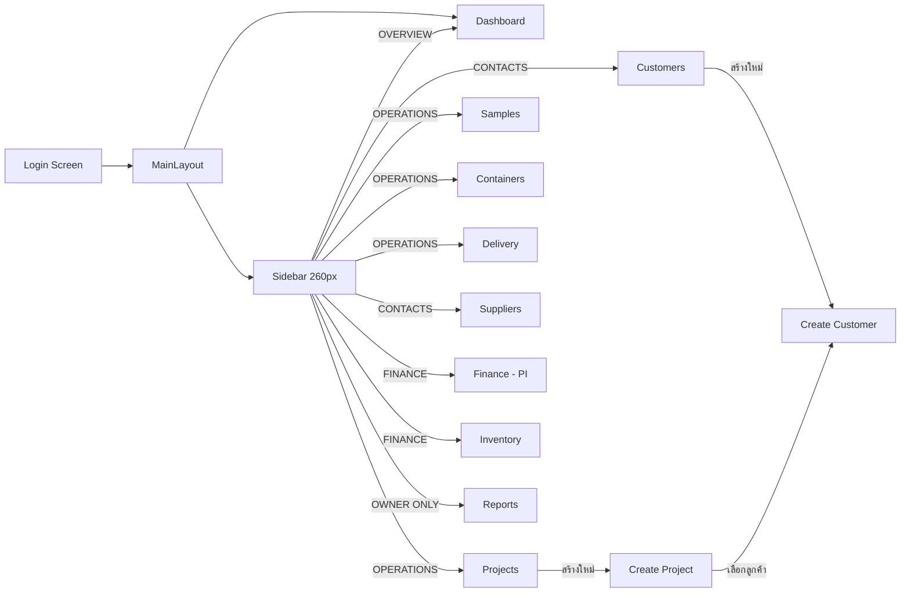
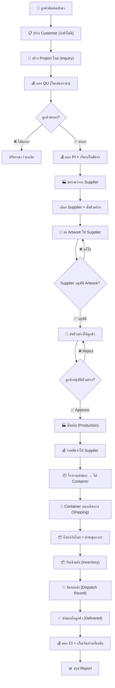
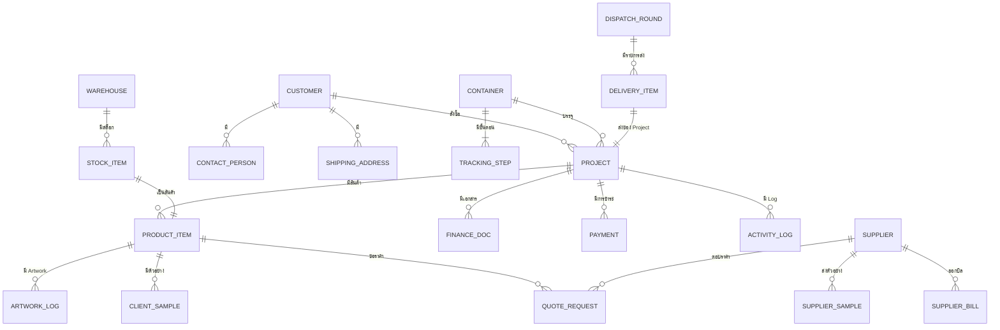

# 📋 PPN GREAT ERP — เอกสารวิเคราะห์ระบบฉบับสมบูรณ์

> **เอกสารนี้จัดทำเพื่อ:** Backend Developer ที่จะพัฒนา API เชื่อมต่อกับ Frontend (Flutter Web)  
> **วันที่วิเคราะห์:** 3 กรกฎาคม 2026  
> **Source Code:** `d:\07_Projects\Work\PNN\ppn_great\lib\`

---

## 📌 สารบัญ

1. [ภาพรวมระบบ](#1-ภาพรวมระบบ)
2. [โครงสร้างสถาปัตยกรรม](#2-โครงสร้างสถาปัตยกรรม)
3. [วิเคราะห์รายโมดูล](#3-วิเคราะห์รายโมดูล)
4. [Business Workflow (End-to-End)](#4-business-workflow-end-to-end)
5. [Data Model & Entity Relationship](#5-data-model--entity-relationship)
6. [API Endpoints ที่ต้องพัฒนา](#6-api-endpoints-ที่ต้องพัฒนา)
7. [ลำดับความสำคัญงาน Backend](#7-ลำดับความสำคัญงาน-backend)

---

## 1. ภาพรวมระบบ

### PPN GREAT คืออะไร?

**PPN GREAT** คือระบบ **ERP สำหรับธุรกิจนำเข้าสินค้า Premiums / ของพรีเมียม** (Import Operation Platform) ที่ออกแบบมาสำหรับ **บริษัท PPN** ซึ่งทำธุรกิจ:

- **รับคำสั่งซื้อ** จากลูกค้าไทย (เช่น Lion, Tesla, AIS, Central Group, Siam Paragon)
- **สั่งผลิต/นำเข้า** สินค้าจากโรงงานในจีน (Guangzhou, Shenzhen, Yiwu)
- **จัดส่ง** สินค้าให้ลูกค้าตามรอบ

### ใครใช้ระบบนี้?

| บทบาท | หน้าที่หลัก |
|--------|------------|
| **เซลส์ (Sales)** | สร้าง Project, จัดการ Inquiry, ส่ง Quotation ลูกค้า |
| **ฝ่ายจัดซื้อ (Procurement)** | ติดต่อ Supplier, ขอราคา, สั่งตัวอย่าง, สั่งผลิต |
| **กราฟิก (Design)** | อัปโหลด Artwork, ติดตามสถานะการอนุมัติแบบ |
| **ฝ่ายการเงิน (Finance)** | ออกใบ QU/PI, รับเงินจากลูกค้า, จ่ายเงินให้ Supplier |
| **คลังสินค้า (Warehouse)** | รับของเข้าคลัง, จัดสต็อก, ตัดยอดส่งของ |
| **ฝ่ายขนส่ง (Logistics)** | ติดตาม Container, จัด Dispatch Round |
| **เจ้าของ (Owner)** | ดู Dashboard ภาพรวม, ดู Reports กำไร/ขาดทุน |

### ธุรกิจทำเงินอย่างไร?

```
ลูกค้าสั่งสินค้า → PPN หาโรงงานจีน → ต่อรองราคา → สั่งผลิต → นำเข้าทางเรือ → ส่งถึงลูกค้า
                                                                    ↑
                                                        กำไร = ราคาขาย - ต้นทุน - ค่าขนส่ง
```

---

## 2. โครงสร้างสถาปัตยกรรม

### 2.1 โครงสร้างไฟล์

```
lib/
├── main.dart                          ← จุดเริ่มต้น App
├── modules/
│   ├── auth/
│   │   └── login_screen.dart          ← หน้า Login (Mock)
│   ├── dashboard/
│   │   └── dashboard_screen.dart      ← Sidebar + Dashboard หลัก
│   ├── orders/
│   │   ├── project_list_screen.dart   ← รายการ Project (3,011 บรรทัด!)
│   │   ├── create_project_screen.dart ← สร้าง Project ใหม่
│   │   ├── samples_screen.dart        ← จัดการตัวอย่างสินค้าให้ลูกค้า
│   │   └── upload_design_screen.dart  ← จัดการ Artwork / ไฟล์งาน
│   ├── customers/
│   │   └── create_customer_screen.dart← CRM ลูกค้า + สร้างลูกค้าใหม่
│   ├── suppliers/
│   │   └── suppliers_screen.dart      ← จัดการ Supplier + ขอราคา + AP
│   ├── finance/
│   │   ├── generate_pi_screen.dart    ← ออกเอกสารการเงิน (QU/PI/DP/CI)
│   │   └── record_payment_screen.dart ← บันทึกรับเงินลูกค้า
│   ├── containers/
│   │   └── containers_screen.dart     ← ติดตาม Container ขนส่งทางเรือ
│   ├── delivery/
│   │   └── delivery_screen.dart       ← จัดรอบส่งสินค้า + ตัดสต็อก
│   ├── inventory/
│   │   └── inventory_screen.dart      ← จัดการคลังสินค้า
│   └── reports/
│       └── reports_screen.dart        ← รายงานสรุป (Owner Only)
```

### 2.2 Navigation (การนำทาง)



### 2.3 UI Layout Pattern

ทุกหน้าจอใช้ Pattern เดียวกัน:

```
┌──────────────┬─────────────────────────────────────┐
│              │                                     │
│   Left Panel │          Right Panel                │
│   (List)     │          (Detail / Form)            │
│   320-380px  │          Expanded                   │
│              │                                     │
│  - Search    │  - Header + Actions                 │
│  - Filter    │  - Content Cards                    │
│  - Item List │  - Tables / Forms                   │
│              │                                     │
└──────────────┴─────────────────────────────────────┘
```

### 2.4 สถานะปัจจุบัน (Frontend)

> [!IMPORTANT]
> **ข้อมูลทั้งหมดเป็น Mock Data ฝังอยู่ในไฟล์ Dart**  
> ยังไม่มีการเชื่อมต่อ Backend / API ใดๆ ทั้งสิ้น  
> State Management ใช้ `setState()` แบบพื้นฐาน

---

## 3. วิเคราะห์รายโมดูล

---

### 📊 3.1 Dashboard (หน้าหลัก)

**ไฟล์:** [dashboard_screen.dart](file:///d:/07_Projects/Work/PNN/ppn_great/lib/modules/dashboard/dashboard_screen.dart)

**หน้าที่:** แสดงภาพรวมธุรกิจทั้งหมดในหน้าเดียว

**สิ่งที่แสดง:**
| ส่วน | รายละเอียด |
|------|-----------|
| KPI Cards (4 ใบ) | Active Projects, Pending Orders, Revenue (MTD), Pending Payments |
| Quick Actions | ปุ่มลัดไปหน้าอื่น (New Project, Finance, Samples ฯลฯ) |
| Recent Activity | Timeline กิจกรรมล่าสุด |
| Revenue Chart | กราฟรายได้รายเดือน |

**ข้อมูลที่ต้องดึงจาก Backend:**
- จำนวน Project ที่ Active
- จำนวน Order ที่ Pending
- ยอดรายได้เดือนนี้ (MTD = Month-to-Date)
- ยอดเงินที่รอชำระ
- รายการกิจกรรมล่าสุด (Activity Log)

---

### 📁 3.2 Projects (โปรเจกต์)

**ไฟล์:** [project_list_screen.dart](file:///d:/07_Projects/Work/PNN/ppn_great/lib/modules/orders/project_list_screen.dart) (3,011 บรรทัด)

**หน้าที่:** ศูนย์กลางจัดการ Project ทั้งหมด — ตั้งแต่รับ Inquiry จนส่งของเสร็จ

#### โครงสร้าง Project

```
Project
├── id: "PPN-001"
├── customer: "Lion (Thailand)"
├── status: "Inquiry" | "Sample" | "Production" | "Shipping" | "Distributing" | "Delivered"
├── date: วันที่สร้าง
├── due_date: กำหนดส่ง
├── step: 0-5 (ขั้นตอนปัจจุบัน)
├── is_active: boolean
├── is_paid: boolean
├── days_left: จำนวนวันที่เหลือ
├── days_in_stage: อยู่ใน Stage ปัจจุบันกี่วัน
├── order_value: "฿1.7M"
├── usage_location: "Marketing campaign in Laos only"
├── finance:
│   ├── deposit: boolean (จ่ายมัดจำแล้วหรือยัง)
│   ├── balance: boolean (จ่ายครบแล้วหรือยัง)
│   └── credit_term: "30 Days" | "45 Days" | "60 Days" | "Advance"
├── compliance:
│   ├── ocpb: boolean (สคบ. ผ่านหรือยัง)
│   └── shipping_mark: boolean (มี Shipping Mark แล้วหรือยัง)
├── products[]:
│   ├── name: "กระเป๋าผ้าคอตตอน"
│   ├── qty: "20,000 ใบ"
│   ├── target_date: กำหนดส่งรายสินค้า
│   ├── specs: รายละเอียดสเปค
│   ├── variations[]: รายการตัวเลือก
│   ├── ref_files[]: ไฟล์อ้างอิง
│   └── artwork_files[]: ไฟล์ Artwork
├── additional_requests[]:
│   ├── desc: คำอธิบาย
│   └── cost: ค่าใช้จ่ายเพิ่ม
└── logs[]:
    ├── time: เวลา
    ├── user: ผู้ทำ
    └── text: รายละเอียด
```

#### สถานะ Project (Pipeline)

```
┌──────────┐    ┌──────────┐    ┌─────────────┐    ┌──────────┐    ┌──────────────┐    ┌───────────┐
│ Inquiry  │ ──▶│  Sample  │ ──▶│ Production  │ ──▶│ Shipping │ ──▶│ Distributing │ ──▶│ Delivered │
│ (step 0) │    │ (step 1) │    │  (step 2)   │    │ (step 3) │    │  (step 4)    │    │ (step 5)  │
└──────────┘    └──────────┘    └─────────────┘    └──────────┘    └──────────────┘    └───────────┘
  สอบถาม        ส่งตัวอย่าง       กำลังผลิต          ขนส่ง          กระจายสินค้า        ส่งเรียบร้อย
```

#### ฟีเจอร์ UI:
- **3 โหมดแสดงผล:** Collapsed (ซ่อน list), Normal (list+detail), Drawer (list ทับ detail)
- **Filter:** ตามสถานะ, ค้นหาด้วยชื่อ/รหัส/สินค้า
- **Sort:** Target Date, Order Value, Days in Stage, Date Created
- **สีบอกความเร่งด่วน:** 🔴 ≤30 วัน, 🟡 ≤45 วัน, 🟢 >45 วัน
- **Detail Panel:** แสดงข้อมูล Compliance (สคบ., Shipping Mark), Finance, Products, Logs

---

### 🔬 3.3 Samples (ตัวอย่างสินค้าสำหรับลูกค้า)

**ไฟล์:** [samples_screen.dart](file:///d:/07_Projects/Work/PNN/ppn_great/lib/modules/orders/samples_screen.dart) (1,331 บรรทัด)

**หน้าที่:** ติดตามการส่งตัวอย่างสินค้าให้ลูกค้าตรวจสอบก่อนสั่งผลิตจริง

#### Flow การทำงาน:

```
                                 ┌─────────────────────┐
                                 │ โรงงานจีนส่งตัวอย่าง │
                                 └──────────┬──────────┘
                                            ▼
┌──────────────────┐    ┌──────────────────┐    ┌──────────────────┐
│ Waiting from     │ ──▶│ Received from    │ ──▶│ Sent to Client   │
│ China            │    │ China            │    │ (ส่งให้ลูกค้า)    │
└──────────────────┘    └──────────────────┘    └──────────┬───────┘
                                                          ▼
                        ┌──────────────────┐    ┌──────────────────┐
                        │ Rejected         │◀──│ Delivered to     │
                        │ (Need Revision)  │    │ Client           │
                        └──────────┬───────┘    └──────────┬───────┘
                                   │                       ▼
                                   │            ┌──────────────────┐
                                   └───────────▶│ Approved by      │
                                    (ส่งใหม่)    │ Client ✅         │
                                                └──────────────────┘
```

#### โครงสร้างข้อมูล Sample:

```
Sample
├── id: "CS-001"
├── attempt: 1 (ครั้งที่ส่ง — สำคัญมาก! ส่งได้หลายครั้ง)
├── type: "Pre-production Sample (PPS)" | "Material Swatch" | "3D Printed Mockup"
├── origin: "China" | "In-Stock"
├── supplier: ชื่อโรงงาน
├── status: สถานะจาก 6 ขั้นตอน
├── sent_date: วันที่ส่ง
├── china_tracking: เลข Tracking จีน
├── local_courier: ชื่อขนส่งในไทย (Kerry, Grab ฯลฯ)
├── local_tracking: เลข Tracking ในไทย
└── feedback: ความคิดเห็น/เหตุผลที่ Reject
```

> [!NOTE]
> **จุดสำคัญ:** ตัวอย่าง 1 ชิ้นอาจถูกส่งหลายครั้ง (attempt 1, 2, 3...) ถ้าลูกค้า Reject ต้องแก้แล้วส่งใหม่  
> Tracking แบ่งเป็น 2 ขา: **จีน → ออฟฟิศ PPN** และ **PPN → ลูกค้า**

---

### 🎨 3.4 Artwork Tracking (ติดตามไฟล์งานออกแบบ)

**ไฟล์:** [upload_design_screen.dart](file:///d:/07_Projects/Work/PNN/ppn_great/lib/modules/orders/upload_design_screen.dart) (1,190 บรรทัด)

**หน้าที่:** ติดตามไฟล์ Artwork ตั้งแต่ลูกค้าส่งมา จนอนุมัติให้ผลิต

#### Flow การทำงาน:

```
┌──────────┐    ┌───────────┐    ┌─────────────────┐    ┌──────────────────┐
│ Awaiting │ ──▶│ Reviewing │ ──▶│ Approved by     │ ──▶│ Approved by      │
│ Approval │    │           │    │ Client          │    │ Supplier (โรงงาน) │
└──────────┘    └─────┬─────┘    └─────────────────┘    └──────────────────┘
                      │
                      ▼
               ┌──────────────┐
               │ Need Revision│ ──▶ (กลับไปแก้ไข → อัปเวอร์ชันใหม่)
               │ / Rejected   │
               └──────────────┘
```

#### โครงสร้างข้อมูล Artwork Log:

```
ArtworkLog
├── id: "ART-001"
├── attempt: 1 (ครั้งที่อัปโหลด)
├── ver: "V1", "V2", "V2.1 (Factory Proof)"
├── source: "In-house Designer" | "Freelance" | "Customer Provided" | "Supplier"
├── status: สถานะ 6 ระดับ
├── date: วันที่อัปโหลด
├── file_name: ชื่อไฟล์
└── feedback: ความคิดเห็น / หมายเหตุ
```

> [!TIP]
> **Factory Proof** = เมื่อลูกค้าอนุมัติแบบแล้ว โรงงานจะส่ง "Factory Proof" (แบบที่วางบนผลิตภัณฑ์จริง) มาให้ตรวจสอบอีกครั้ง ก่อนเริ่มผลิตจริง

---

### 👥 3.5 Customers (ลูกค้า / CRM)

**ไฟล์:** [create_customer_screen.dart](file:///d:/07_Projects/Work/PNN/ppn_great/lib/modules/customers/create_customer_screen.dart) (2,321 บรรทัด)

**หน้าที่:** จัดการข้อมูลลูกค้าทั้งหมด + CRM ขนาดย่อม

#### โครงสร้างข้อมูลลูกค้า:

```
Customer
├── name: "บริษัท สยามพารากอน จำกัด"
├── type: "Enterprise" | "Mid-Market" | "SME"
├── customer_status: "Active" | "Inactive"
├── lead_source: "Facebook Ads" | "Google Search" | "Referral" | "Exhibition" | "Direct Contact"
├── tax_id: เลขประจำตัวผู้เสียภาษี
├── branch: "สำนักงานใหญ่ (HQ)" | "สาขาย่อย (Branch)"
├── industry: "Retail / ค้าปลีก" | "Technology / ไอที"
├── internal_note: หมายเหตุภายใน
│
├── contacts[]: (รองรับหลายคน)
│   ├── name: ชื่อ
│   ├── role: "Owner / CEO" | "Marketing Director" | "Procurement Manager" ...
│   ├── phone: เบอร์โทร
│   ├── email: อีเมล
│   ├── line: LINE ID
│   └── other_chat: WeChat ฯลฯ
│
├── billing_address: ที่อยู่สำหรับออกบิล
├── shipping_addresses[]: (รองรับหลายที่)
│   ├── label: "โกดังรับสินค้า (บางพลี)"
│   └── address: ที่อยู่เต็ม
│
├── stats: (สถิติสำคัญ)
│   ├── revenue_lifetime: รายได้ตลอดชีพ
│   ├── revenue_this_year / revenue_last_year
│   ├── projects_completed / projects_active
│   ├── payment_on_time / payment_total (คำนวณ % จ่ายตรงเวลา)
│   ├── has_outstanding: มียอดค้างชำระ?
│   ├── last_paid: วันที่จ่ายล่าสุด
│   ├── customer_since: ลูกค้ามาตั้งแต่เมื่อไหร่
│   └── avg_projects_year: เฉลี่ยกี่ Project ต่อปี
│
└── projects[]: รายการ Project ที่เกี่ยวข้อง
```

#### ฟีเจอร์หลัก:
- **สร้างลูกค้าใหม่:** ฟอร์มเต็มรูปแบบ (ข้อมูลบริษัท, ผู้ติดต่อ, ที่อยู่)
- **ดูโปรไฟล์ลูกค้า:** Layout 80/20 (80% Detail + 20% Stats)
- **Customer Tier:** แบ่ง 3 ระดับตามมูลค่า
- **Quick Action:** สร้าง Project ใหม่จากหน้าลูกค้าได้เลย

---

### 🏭 3.6 Suppliers (ซัพพลายเออร์ / โรงงาน)

**ไฟล์:** [suppliers_screen.dart](file:///d:/07_Projects/Work/PNN/ppn_great/lib/modules/suppliers/suppliers_screen.dart) (2,652 บรรทัด)

**หน้าที่:** จัดการโรงงานผู้ผลิตในจีน + 3 Tabs หลัก

#### 3 Tabs หลัก:

##### Tab 1: Quotes (ขอราคา)
```
QuoteRequest
├── project_id: "PRJ-001"
├── customer: ชื่อลูกค้า
├── product: ชื่อสินค้า
├── qty: จำนวน
├── status: "Waiting Link" | "Link Sent" | "Price Filled" | "Approved"
├── specs: รายละเอียดสเปค
├── variations: ตัวเลือก
├── target_date: กำหนดส่ง
├── packing: ประเภทบรรจุภัณฑ์
│
│ (เมื่อ Supplier กรอกราคาแล้ว)
├── quoted_price: ราคา (USD)
├── currency: สกุลเงิน
├── lead_time: ระยะเวลาผลิต
├── moq: จำนวนขั้นต่ำ
└── remark: หมายเหตุ
```

##### Tab 2: Samples (ขอตัวอย่างจากโรงงาน)
```
SupplierSample
├── project_id, customer, product
├── status: "Waiting Supplier" | "Sample Sent" | "Approved"
├── specs: รายละเอียดที่ต้องการ
├── cost: ค่าใช้จ่าย ("Free" หรือ ระบุราคา)
├── tracking_no: เลข Tracking
└── expected_date: วันที่คาดว่าจะได้รับ
```

##### Tab 3: Payments / AP (รอบบิลจ่ายเงินให้ Supplier)
```
SupplierBill
├── id: "BILL-011"
├── project_id, product
├── type: "Deposit (30%)" | "Balance (70%)" | "Full Payment"
├── amount_thb: จำนวนเงิน (บาท)
├── due_month: กำหนดชำระ
├── status: "Pending" | "Paid" | "Overdue"
├── pi_uploaded: boolean (แนบ PI แล้วหรือยัง)
└── invoice_uploaded: boolean (แนบ Invoice แล้วหรือยัง)
```

> [!IMPORTANT]
> **Supplier เป็นหัวใจของระบบจัดซื้อ** — เชื่อมกับ Quotes, Samples, และ AP (Accounts Payable) ทั้งหมด  
> ระบบรองรับการ "ส่งลิงก์ขอราคา" ให้ Supplier กรอกราคาเอง (self-service)

---

### 💰 3.7 Finance (การเงิน)

#### 3.7.1 Generate PI (ออกเอกสารการเงิน)

**ไฟล์:** [generate_pi_screen.dart](file:///d:/07_Projects/Work/PNN/ppn_great/lib/modules/finance/generate_pi_screen.dart)

**เอกสาร 4 ประเภท:**

| ประเภท | ชื่อเต็ม | ใช้ตอนไหน |
|--------|---------|----------|
| **QU** | Quotation (ใบเสนอราคา) | ขั้นตอน Inquiry — ส่งให้ลูกค้าพิจารณา |
| **PI** | Proforma Invoice (ใบแจ้งหนี้ล่วงหน้า) | ลูกค้าตกลง — ออกบิลเรียกเก็บมัดจำ |
| **DP** | Deposit Invoice (ใบวางมัดจำ) | รับเงินมัดจำจากลูกค้า |
| **CI** | Commercial Invoice (ใบกำกับสินค้า) | ส่งของแล้ว — ออกบิลเรียกเก็บส่วนที่เหลือ |

```
Flow การออกเอกสาร:

 QU (เสนอราคา) ──▶ PI (แจ้งหนี้) ──▶ DP (รับมัดจำ) ──▶ CI (เก็บยอดเหลือ)
                                          ↓
                                    ลูกค้าจ่ายเงิน
```

#### โครงสร้างข้อมูลเอกสาร:

```
FinanceDocument
├── doc_no: "QU-2026-0011"
├── project_id: "PPN-001"
├── customer: ชื่อลูกค้า
├── product_name: ชื่อสินค้า
├── qty: จำนวน
├── doc_type: "QU" | "PI" | "DP" | "CI"
├── status: "Draft" | "Sent" | "Paid" | "Overdue"
├── amount: จำนวนเงิน
├── credit_term: เงื่อนไขชำระ
├── issue_date: วันที่ออก
├── due_date: กำหนดชำระ
└── items[]:
    ├── name: รายการ
    ├── qty: จำนวน
    ├── unit_price: ราคาต่อหน่วย
    └── total: ยอดรวม
```

#### 3.7.2 Record Payment (บันทึกรับเงิน)

**ไฟล์:** [record_payment_screen.dart](file:///d:/07_Projects/Work/PNN/ppn_great/lib/modules/finance/record_payment_screen.dart)

```
PaymentRecord
├── id: "PAY-001"
├── project_id: "PPN-001"
├── customer: ชื่อลูกค้า
├── type: "Deposit" | "Balance" | "Full"
├── amount: จำนวนเงิน
├── method: "Bank Transfer" | "Cheque" | "Cash"
├── date: วันที่รับเงิน
├── status: "Confirmed" | "Pending Verification"
├── slip_attached: boolean (แนบสลิปแล้วหรือยัง)
└── verified_by: ผู้ยืนยัน
```

---

### 🚢 3.8 Containers (ติดตามตู้สินค้า)

**ไฟล์:** [containers_screen.dart](file:///d:/07_Projects/Work/PNN/ppn_great/lib/modules/containers/containers_screen.dart)

**หน้าที่:** ติดตามตู้ Container ที่ขนสินค้าจากจีนมาไทย

#### 3 ขั้นตอนการขนส่ง:

```
┌──────────────────────┐    ┌──────────────────────┐    ┌──────────────────────┐
│  📦 Step 1           │    │  🚢 Step 2           │    │  🏭 Step 3           │
│  Factory → Port      │ ──▶│  Sailing (กำลังเดินทาง)│ ──▶│  Port → Warehouse   │
│  (โรงงาน → ท่าเรือ)  │    │  (ทางเรือ)            │    │  (ท่าเรือ → คลัง)     │
│                      │    │                      │    │                      │
│  ข้อมูล:              │    │  ข้อมูล:              │    │  ข้อมูล:              │
│  - วันออกจากโรงงาน    │    │  - ETD (วันออก)       │    │  - วันถึงท่าเรือไทย   │
│  - เลข Tracking      │    │  - ETA (วันถึง)       │    │  - ผ่านพิธีศุลกากร     │
│  - วันถึงท่าเรือจีน   │    │  - ชื่อเรือ           │    │  - วันส่งถึงคลัง       │
└──────────────────────┘    │  - เลขตู้             │    └──────────────────────┘
                            └──────────────────────┘
```

#### โครงสร้างข้อมูล:

```
Container
├── id: "CONT-001"
├── project_ids[]: รหัส Project ที่อยู่ในตู้นี้
├── status: "Factory → Port" | "Sailing" | "Port → Warehouse" | "Delivered"
├── container_no: เลขตู้ Container
├── vessel_name: ชื่อเรือ
├── port_origin: ท่าเรือต้นทาง
├── port_destination: ท่าเรือปลายทาง
│
├── step1:
│   ├── factory_departure: วันออกจากโรงงาน
│   ├── tracking_no: เลข Tracking
│   └── port_arrival: วันถึงท่าเรือจีน
├── step2:
│   ├── etd: วันเรือออก
│   ├── eta: วันเรือถึง (ประมาณ)
│   └── actual_arrival: วันถึงจริง
└── step3:
    ├── customs_cleared: ผ่านศุลกากรแล้วหรือยัง
    ├── customs_date: วันที่ผ่าน
    └── warehouse_arrival: วันถึงคลังสินค้า
```

---

### 🚚 3.9 Delivery (จัดส่งสินค้า)

**ไฟล์:** [delivery_screen.dart](file:///d:/07_Projects/Work/PNN/ppn_great/lib/modules/delivery/delivery_screen.dart)

**หน้าที่:** จัดรอบส่งสินค้าให้ลูกค้า + **ตัดสต็อกอัตโนมัติ**

#### ระบบ Dispatch Round:

```
Dispatch Round (รอบส่ง)
├── id: "DR-001"
├── date: วันที่ส่ง
├── status: "Scheduled" | "In Transit" | "Delivered"
├── driver: ชื่อคนขับ
├── vehicle: ทะเบียนรถ
│
└── deliveries[]:
    ├── project_id: "PPN-001"
    ├── customer: ชื่อลูกค้า
    ├── address: ที่อยู่ส่ง
    ├── products[]:
    │   ├── name: ชื่อสินค้า
    │   ├── qty_to_deliver: จำนวนที่ส่ง
    │   └── warehouse: ส่งจากคลังไหน
    └── notes: หมายเหตุ
```

> [!WARNING]
> **เมื่อ Confirm Dispatch → ระบบต้องตัดสต็อกจากคลังอัตโนมัติ**  
> นี่คือจุดที่ต้องทำเป็น **Transaction** ใน Backend ให้ดี (ตัดสต็อก + บันทึก Delivery ต้อง Atomic)

---

### 📦 3.10 Inventory (คลังสินค้า)

**ไฟล์:** [inventory_screen.dart](file:///d:/07_Projects/Work/PNN/ppn_great/lib/modules/inventory/inventory_screen.dart)

**หน้าที่:** จัดการสต็อกสินค้าแยกรายคลัง

#### โครงสร้างข้อมูล:

```
Warehouse
├── id: "WH-001"
├── name: "คลังสินค้า บางพลี"
├── location: ที่อยู่
└── products[]:
    ├── product_id: รหัสสินค้า
    ├── name: ชื่อสินค้า
    ├── project_id: โปรเจกต์ที่เกี่ยวข้อง
    ├── qty_in_stock: จำนวนในสต็อก
    ├── qty_reserved: จำนวนที่จอง (รอส่ง)
    ├── qty_available: จำนวนที่พร้อมใช้
    ├── last_received: วันที่รับเข้าล่าสุด
    └── location_in_warehouse: ตำแหน่งในคลัง (เช่น "Rack A-3")
```

#### ฟีเจอร์:
- **แยกดูตามคลัง:** เลือกดูสต็อกเฉพาะคลังที่ต้องการ
- **Search:** ค้นหาสินค้าข้ามคลัง
- **Stock Movement:** ดูประวัติการเคลื่อนไหวสต็อก (เข้า/ออก)
- **Low Stock Alert:** แจ้งเตือนเมื่อสินค้าใกล้หมด

---

### 📈 3.11 Reports (รายงานสรุป — Owner Only)

**ไฟล์:** [reports_screen.dart](file:///d:/07_Projects/Work/PNN/ppn_great/lib/modules/reports/reports_screen.dart)

**หน้าที่:** รายงานสรุปภาพรวมสำหรับเจ้าของธุรกิจ

#### 2 หมวดหลัก:

##### Financial Summary (สรุปการเงิน)
| ข้อมูล | คำอธิบาย |
|--------|---------|
| Total Revenue | รายได้รวม |
| Total COGS | ต้นทุนสินค้า (Cost of Goods Sold) |
| Gross Profit | กำไรขั้นต้น |
| Gross Margin % | อัตรากำไรขั้นต้น |
| Pending Receivables | ยอดลูกหนี้ค้างรับ |
| Pending Payables | ยอดเจ้าหนี้ค้างจ่าย |

##### Operational Summary (สรุปปฏิบัติการ)
| ข้อมูล | คำอธิบาย |
|--------|---------|
| Active Projects | จำนวน Project ที่กำลังดำเนินการ |
| Avg. Lead Time | ระยะเวลาเฉลี่ยตั้งแต่สั่งถึงส่ง |
| On-time Delivery % | อัตราส่งตรงเวลา |
| Container Utilization | อัตราใช้ประโยชน์ตู้ Container |

#### สูตรคำนวณสำคัญ:
```
กำไรขั้นต้น = ราคาขายให้ลูกค้า - ต้นทุนจากโรงงาน - ค่าขนส่ง - ค่าใช้จ่ายเพิ่มเติม

Gross Margin % = (กำไรขั้นต้น / ราคาขาย) × 100
```

---

## 4. Business Workflow (End-to-End)

### 🔄 Workflow หลัก: จากรับ Inquiry ถึงส่งของ



### 📋 สรุป Workflow ตามแต่ละบทบาท

#### เซลส์ (Sales)
```
1. รับ Inquiry จากลูกค้า
2. สร้าง Customer + Project
3. ประสานกับ Procurement เรื่องราคา
4. ออก QU ส่งลูกค้า
5. ส่ง Sample ให้ลูกค้าตรวจ
6. Follow up Artwork Approval
7. ติดตามสถานะ Project จนส่งเสร็จ
```

#### ฝ่ายจัดซื้อ (Procurement)
```
1. รับ Spec สินค้าจากเซลส์
2. ส่งขอราคาจาก Supplier (Request Quote)
3. เปรียบเทียบราคา เลือก Supplier
4. สั่งตัวอย่าง (Request Sample)
5. ส่ง Artwork ให้โรงงาน
6. สั่งผลิตจริง + ติดตาม
7. จัดการ Container Tracking
```

#### ฝ่ายการเงิน (Finance)
```
1. ออก QU → PI → DP → CI ตามลำดับ
2. รับเงินจากลูกค้า (Record Payment)
3. จ่ายเงินให้ Supplier (AP)
4. ตรวจสอบยอดค้างชำระ
5. สรุปรายงานการเงิน
```

#### คลังสินค้า (Warehouse)
```
1. รับแจ้ง Container มาถึง
2. ตรวจรับสินค้าเข้าคลัง
3. อัปเดตสต็อก
4. จัดเตรียมของตาม Dispatch Round
5. ตัดสต็อกเมื่อส่งของ
```

---

## 5. Data Model & Entity Relationship

### 📊 ER Diagram (ความสัมพันธ์ระหว่าง Entity)



### 📋 ตาราง Database ที่ต้องสร้าง

| ตาราง | คำอธิบาย | ความสำคัญ |
|-------|---------|----------|
| `customers` | ข้อมูลลูกค้า | 🔴 สูง |
| `contact_persons` | ผู้ติดต่อของลูกค้า (1-to-many) | 🔴 สูง |
| `shipping_addresses` | ที่อยู่จัดส่งของลูกค้า | 🟡 กลาง |
| `projects` | โปรเจกต์ | 🔴 สูง |
| `product_items` | สินค้าในโปรเจกต์ | 🔴 สูง |
| `product_variations` | ตัวเลือกสินค้า | 🟡 กลาง |
| `product_files` | ไฟล์อ้างอิง/Artwork | 🟡 กลาง |
| `additional_requests` | คำขอเพิ่มเติม | 🟡 กลาง |
| `suppliers` | ข้อมูล Supplier | 🔴 สูง |
| `quote_requests` | ใบขอราคาจาก Supplier | 🔴 สูง |
| `supplier_samples` | ตัวอย่างจาก Supplier | 🟡 กลาง |
| `supplier_bills` | บิลจ่ายเงิน Supplier (AP) | 🔴 สูง |
| `client_samples` | ตัวอย่างส่งให้ลูกค้า | 🟡 กลาง |
| `artwork_logs` | ประวัติ Artwork | 🟡 กลาง |
| `finance_documents` | เอกสารการเงิน (QU/PI/DP/CI) | 🔴 สูง |
| `finance_doc_items` | รายการในเอกสารการเงิน | 🔴 สูง |
| `payments` | บันทึกรับเงิน | 🔴 สูง |
| `containers` | ตู้ Container | 🟡 กลาง |
| `container_tracking` | Tracking ขั้นตอนขนส่ง | 🟡 กลาง |
| `warehouses` | คลังสินค้า | 🟡 กลาง |
| `stock_items` | สต็อกสินค้ารายคลัง | 🔴 สูง |
| `stock_movements` | ประวัติเคลื่อนไหวสต็อก | 🟡 กลาง |
| `dispatch_rounds` | รอบจัดส่ง | 🟡 กลาง |
| `delivery_items` | รายการสินค้าในรอบส่ง | 🟡 กลาง |
| `activity_logs` | Log กิจกรรม | 🟢 ต่ำ |
| `users` | ผู้ใช้งานระบบ | 🔴 สูง |

---

## 6. API Endpoints ที่ต้องพัฒนา

### 🔐 Authentication

| Method | Endpoint | คำอธิบาย |
|--------|----------|---------|
| POST | `/api/auth/login` | เข้าสู่ระบบ |
| POST | `/api/auth/logout` | ออกจากระบบ |
| GET | `/api/auth/me` | ดึงข้อมูลผู้ใช้ปัจจุบัน |

---

### 📊 Dashboard

| Method | Endpoint | คำอธิบาย |
|--------|----------|---------|
| GET | `/api/dashboard/summary` | KPI Cards (Active Projects, Pending Orders, Revenue MTD, Pending Payments) |
| GET | `/api/dashboard/recent-activities` | รายการกิจกรรมล่าสุด |
| GET | `/api/dashboard/revenue-chart` | ข้อมูลกราฟรายได้รายเดือน |

---

### 👥 Customers

| Method | Endpoint | คำอธิบาย |
|--------|----------|---------|
| GET | `/api/customers` | ดึงรายชื่อลูกค้าทั้งหมด (`?status=Active&search=xxx`) |
| GET | `/api/customers/:id` | ดึงรายละเอียดลูกค้า (รวม contacts, addresses, stats, projects) |
| POST | `/api/customers` | สร้างลูกค้าใหม่ |
| PUT | `/api/customers/:id` | แก้ไขข้อมูลลูกค้า |
| POST | `/api/customers/:id/contacts` | เพิ่มผู้ติดต่อ |
| PUT | `/api/customers/:id/contacts/:contactId` | แก้ไขผู้ติดต่อ |
| DELETE | `/api/customers/:id/contacts/:contactId` | ลบผู้ติดต่อ |
| POST | `/api/customers/:id/shipping-addresses` | เพิ่มที่อยู่จัดส่ง |
| GET | `/api/customers/:id/stats` | สถิติลูกค้า (Revenue, Payment %) |

---

### 📁 Projects

| Method | Endpoint | คำอธิบาย |
|--------|----------|---------|
| GET | `/api/projects` | ดึงรายการ Project (`?status=Production&sort=target_date&search=xxx`) |
| GET | `/api/projects/:id` | ดึงรายละเอียด Project (รวม products, finance, compliance, logs) |
| POST | `/api/projects` | สร้าง Project ใหม่ |
| PUT | `/api/projects/:id` | แก้ไข Project |
| PATCH | `/api/projects/:id/status` | อัปเดตสถานะ Project (เลื่อน Stage) |
| POST | `/api/projects/:id/products` | เพิ่มสินค้าใน Project |
| PUT | `/api/projects/:id/products/:productId` | แก้ไขสินค้า |
| POST | `/api/projects/:id/additional-requests` | เพิ่มคำขอพิเศษ |
| GET | `/api/projects/:id/logs` | ดึง Activity Log ของ Project |

---

### 🔬 Samples (ตัวอย่างสำหรับลูกค้า)

| Method | Endpoint | คำอธิบาย |
|--------|----------|---------|
| GET | `/api/samples` | ดึงรายการ Project ที่มี Sample (`?search=xxx`) |
| GET | `/api/samples/project/:projectId` | ดึง Sample ทั้งหมดของ Project |
| POST | `/api/samples` | สร้าง Sample ใหม่ (ระบุ project_id, product_id) |
| PUT | `/api/samples/:id` | แก้ไข Sample |
| PATCH | `/api/samples/:id/status` | อัปเดตสถานะ Sample |
| PATCH | `/api/samples/:id/tracking` | อัปเดต Tracking (China / Local) |

---

### 🎨 Artwork

| Method | Endpoint | คำอธิบาย |
|--------|----------|---------|
| GET | `/api/artworks` | ดึงรายการ Project ที่มี Artwork |
| GET | `/api/artworks/project/:projectId` | ดึง Artwork Log ทั้งหมดของ Project |
| POST | `/api/artworks` | เพิ่ม Artwork Log ใหม่ (พร้อม Upload ไฟล์) |
| PUT | `/api/artworks/:id` | แก้ไข Artwork Log |
| PATCH | `/api/artworks/:id/status` | อัปเดตสถานะ Artwork |
| PATCH | `/api/artworks/:id/feedback` | อัปเดต Feedback |
| POST | `/api/artworks/:id/upload` | อัปโหลดไฟล์ Artwork |

---

### 🏭 Suppliers

| Method | Endpoint | คำอธิบาย |
|--------|----------|---------|
| GET | `/api/suppliers` | ดึงรายชื่อ Supplier (`?search=xxx`) |
| GET | `/api/suppliers/:id` | ดึงรายละเอียด Supplier (รวม quotes, samples, bills) |
| POST | `/api/suppliers` | เพิ่ม Supplier ใหม่ |
| PUT | `/api/suppliers/:id` | แก้ไข Supplier |

#### Quotes (ขอราคา)
| Method | Endpoint | คำอธิบาย |
|--------|----------|---------|
| GET | `/api/suppliers/:id/quotes` | ดึงใบขอราคาทั้งหมดของ Supplier |
| POST | `/api/suppliers/:id/quotes` | สร้างใบขอราคาใหม่ |
| PUT | `/api/suppliers/:id/quotes/:quoteId` | แก้ไข/อัปเดตราคา |
| PATCH | `/api/suppliers/:id/quotes/:quoteId/status` | อัปเดตสถานะ Quote |

#### Supplier Samples
| Method | Endpoint | คำอธิบาย |
|--------|----------|---------|
| GET | `/api/suppliers/:id/samples` | ดึงตัวอย่างทั้งหมดของ Supplier |
| POST | `/api/suppliers/:id/samples` | สร้างใบขอตัวอย่าง |
| PUT | `/api/suppliers/:id/samples/:sampleId` | แก้ไข |
| PATCH | `/api/suppliers/:id/samples/:sampleId/status` | อัปเดตสถานะ |

#### Supplier Bills (AP)
| Method | Endpoint | คำอธิบาย |
|--------|----------|---------|
| GET | `/api/suppliers/:id/bills` | ดึงบิลทั้งหมดของ Supplier |
| POST | `/api/suppliers/:id/bills` | สร้างบิลใหม่ |
| PATCH | `/api/suppliers/:id/bills/:billId/pay` | ทำเครื่องหมายว่าจ่ายแล้ว |
| POST | `/api/suppliers/:id/bills/:billId/upload-doc` | อัปโหลดเอกสาร (PI / Invoice) |

---

### 💰 Finance

| Method | Endpoint | คำอธิบาย |
|--------|----------|---------|
| GET | `/api/finance/documents` | ดึงเอกสารการเงินทั้งหมด (`?type=QU&status=Draft`) |
| GET | `/api/finance/documents/:id` | ดึงรายละเอียดเอกสาร |
| POST | `/api/finance/documents` | สร้างเอกสารใหม่ (QU/PI/DP/CI) |
| PUT | `/api/finance/documents/:id` | แก้ไขเอกสาร |
| PATCH | `/api/finance/documents/:id/status` | อัปเดตสถานะ (Draft → Sent → Paid) |
| POST | `/api/finance/documents/:id/generate-pdf` | สร้าง PDF |
| GET | `/api/finance/payments` | ดึงรายการรับเงินทั้งหมด |
| POST | `/api/finance/payments` | บันทึกรับเงิน |
| PATCH | `/api/finance/payments/:id/verify` | ยืนยันการรับเงิน |
| POST | `/api/finance/payments/:id/upload-slip` | อัปโหลดสลิป |

---

### 🚢 Containers

| Method | Endpoint | คำอธิบาย |
|--------|----------|---------|
| GET | `/api/containers` | ดึงรายการ Container ทั้งหมด (`?status=Sailing`) |
| GET | `/api/containers/:id` | ดึงรายละเอียด Container |
| POST | `/api/containers` | สร้าง Container ใหม่ |
| PUT | `/api/containers/:id` | แก้ไข Container |
| PATCH | `/api/containers/:id/step` | อัปเดตขั้นตอน (Step 1→2→3) |
| PATCH | `/api/containers/:id/tracking` | อัปเดต Tracking Info |

---

### 🚚 Delivery

| Method | Endpoint | คำอธิบาย |
|--------|----------|---------|
| GET | `/api/delivery/rounds` | ดึงรอบส่งทั้งหมด |
| GET | `/api/delivery/rounds/:id` | ดึงรายละเอียดรอบส่ง |
| POST | `/api/delivery/rounds` | สร้างรอบส่งใหม่ |
| POST | `/api/delivery/rounds/:id/items` | เพิ่มรายการส่ง |
| PATCH | `/api/delivery/rounds/:id/confirm` | ยืนยันส่ง (**→ ตัดสต็อก**) |
| PATCH | `/api/delivery/rounds/:id/complete` | ส่งเสร็จสมบูรณ์ |

---

### 📦 Inventory

| Method | Endpoint | คำอธิบาย |
|--------|----------|---------|
| GET | `/api/inventory/warehouses` | ดึงรายชื่อคลัง |
| GET | `/api/inventory/warehouses/:id/stocks` | ดึงสต็อกในคลัง (`?search=xxx`) |
| POST | `/api/inventory/receive` | รับสินค้าเข้าคลัง |
| POST | `/api/inventory/transfer` | โอนย้ายระหว่างคลัง |
| GET | `/api/inventory/movements` | ดึงประวัติเคลื่อนไหวสต็อก |
| GET | `/api/inventory/low-stock` | สินค้าที่ใกล้หมด |

---

### 📈 Reports

| Method | Endpoint | คำอธิบาย |
|--------|----------|---------|
| GET | `/api/reports/financial-summary` | สรุปการเงิน (Revenue, COGS, Profit) |
| GET | `/api/reports/operational-summary` | สรุปปฏิบัติการ |
| GET | `/api/reports/revenue-by-month` | รายได้รายเดือน |
| GET | `/api/reports/profit-by-project` | กำไรรายโปรเจกต์ |
| GET | `/api/reports/customer-ranking` | จัดอันดับลูกค้า |
| GET | `/api/reports/supplier-performance` | ประเมิน Supplier |

---

## 7. ลำดับความสำคัญงาน Backend

### 🔴 Phase 1 — Foundation (ต้องทำก่อน)

| ลำดับ | งาน | เหตุผล |
|-------|-----|--------|
| 1 | Auth + Users | ทุกอย่างต้องมี Login ก่อน |
| 2 | Customers CRUD | เป็น Master Data หลัก |
| 3 | Projects CRUD + Status Pipeline | หัวใจของระบบ |
| 4 | Suppliers CRUD | จำเป็นสำหรับ Procurement |
| 5 | Finance Documents (QU/PI/DP/CI) | ไม่มีเอกสาร = ไม่มีรายได้ |

### 🟡 Phase 2 — Operations (ขยายฟังก์ชัน)

| ลำดับ | งาน | เหตุผล |
|-------|-----|--------|
| 6 | Quote Requests (Supplier) | จัดซื้อต้องใช้ |
| 7 | Client Samples + Artwork | ขั้นตอนก่อนผลิต |
| 8 | Payments (AR + AP) | รับเงิน/จ่ายเงิน |
| 9 | Inventory + Stock | คลังสินค้า |
| 10 | Containers Tracking | ติดตามขนส่ง |

### 🟢 Phase 3 — Delivery & Reports (ปิดรอบ)

| ลำดับ | งาน | เหตุผล |
|-------|-----|--------|
| 11 | Delivery + Dispatch (ตัดสต็อก) | ปิดรอบส่งของ |
| 12 | Dashboard API | รวมข้อมูลจากทุกส่วน |
| 13 | Reports + Analytics | Owner ใช้ดูภาพรวม |
| 14 | Activity Logs | Nice-to-have |

---

> [!CAUTION]
> ### จุดที่ต้องระวังเป็นพิเศษ (Backend)
> 
> 1. **Delivery → ตัดสต็อก** ต้องเป็น **Atomic Transaction** (ถ้าตัดสต็อกแล้ว Delivery ต้องสำเร็จ)
> 2. **Finance Document Numbering** ต้อง Auto-generate เลขที่เอกสารไม่ซ้ำ (เช่น `QU-2026-0012`)
> 3. **Credit Term** ต้องคำนวณ Due Date จาก Issue Date + Term Days อัตโนมัติ
> 4. **Multi-currency** Supplier ใช้ USD/RMB แต่ระบบจัดเก็บเป็น THB (ต้องมีอัตราแลกเปลี่ยน)
> 5. **File Upload** สำหรับ Artwork, Slip, Invoice, PI — ต้องมี Storage Service
> 6. **Permission / Role** ต้องแบ่ง (Owner เห็น Reports, เซลส์ไม่เห็น ฯลฯ)

---

> **สร้างโดย:** Antigravity AI Assistant  
> **วันที่:** 3 กรกฎาคม 2026
