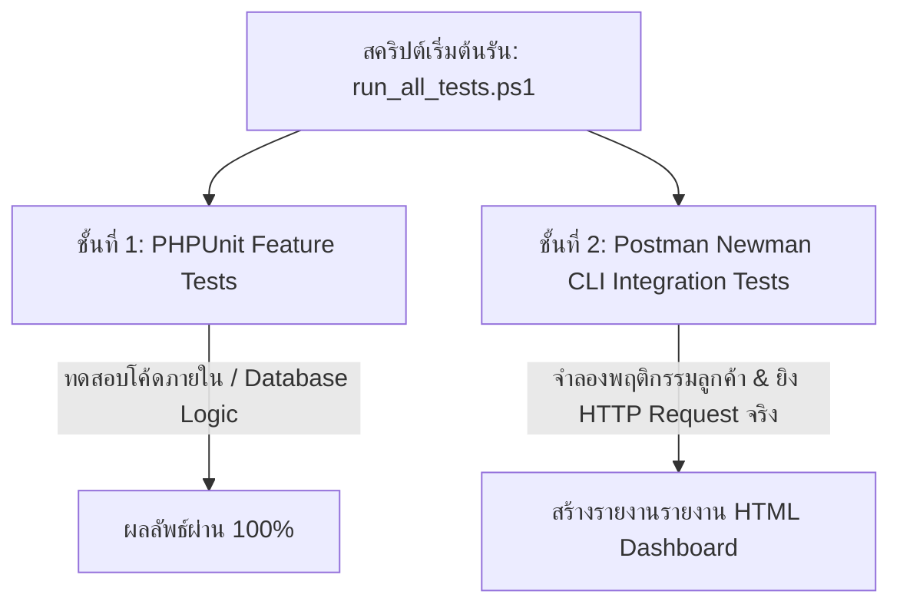

# 🛠️ คู่มือโครงสร้างระบบทดสอบอัตโนมัติ (PPN GREAT Testing & Automation Infrastructure Guide)

เอกสารฉบับนี้จัดทำขึ้นเพื่ออธิบายรายละเอียด **สถาปัตยกรรมการทดสอบ (Testing Infrastructure)** ของระบบ PPN GREAT ซึ่งประกอบด้วยการทำงานของชุดสคริปต์ ตัวโปรแกรมทดสอบ และระบบรายงานผลลัพธ์แบบโต้ตอบ (Interactive HTML Report) อย่างเจาะลึก

---

## 🏗️ 1. ภาพรวมเครื่องมือและระบบทดสอบ (Testing Tools Stack)

สถาปัตยกรรมการทดสอบของเราสร้างขึ้นตามสถาปัตยกรรม **"Dual-Layer Testing"** ซึ่งทดสอบระบบในสองระดับที่แตกต่างกัน เพื่อการันตีความถูกต้องของโค้ดอย่างมีคุณภาพสูงสุด:

### รายละเอียดเครื่องมือในระบบ:
1.  **PHPUnit (Laravel Feature Tests):**
    *   **หน้าที่:** ทดสอบตรรกะภายในระบบหลังบ้าน (Backend Internal Logic), ตรวจสอบความถูกต้องของ Database Transactions (การตัดสต็อก, การจองสต็อก), การยืนยันสเตตัสในฐานข้อมูลระดับลึก
    *   **คุณลักษณะพิเศษ:** รันบน SQLite Memory Database ทำให้ทำงานรวดเร็วและสะอาด ไม่ปนเปื้อนข้อมูลจริง
2.  **Postman Collection:**
    *   **หน้าที่:** กำหนดเส้นทาง URL, วิธีส่ง Request และรวบรวมฟลูเดอร์ขั้นตอนการทำงานของธุรกิจ (Auth -> Customer -> Project -> Supplier -> Logistics -> Finance -> Report)
3.  **Newman CLI & HTML Extra Reporter (NPX Node.js):**
    *   **หน้าที่:** รันไฟล์ทดสอบ Postman Collection โดยตรงจาก Terminal และประมวลผลออกมาเป็นแดชบอร์ดความสวยงามสูง
4.  **Database Seeding (Dummy Data):**
    *   **หน้าที่:** เติมข้อมูลสถานการณ์จำลองสำหรับการทดสอบ API จริง ให้หน้าบ้านเห็นสถิติแดชบอร์ด รายได้ และกราฟยอดขายประวัติ 12 เดือนที่สมจริง

---

## 📜 2. อธิบายการทำงานของสคริปต์แบบละเอียด (Line-by-Line Script Analysis)

### 2.1 สคริปต์ควบคุมหลัก: `run_all_tests.ps1`
สคริปต์นี้ทำหน้าที่จัดระเบียบและควบคุมจังหวะการรันการทดสอบทั้งหมดให้อยู่ในชุดเดียวกัน

1.  **ตรวจสอบความพร้อมของ API Server (บรรทัดที่ 10-31):**
    *   ทำการส่งคำขอทดลองดึงสเตตัสแบบเงียบไปยังพอร์ต `http://127.0.0.1:8000`
    *   หากเซิร์ฟเวอร์ยังไม่เปิด สคริปต์จะแจ้งเตือนคำสั่งสีแดงและยุติการรันทันทีเพื่อลดความสูญเสียเวลาของผู้รัน
2.  **รันการทดสอบระดับลึก Laravel (บรรทัดที่ 33-38):**
    *   ย้ายตำแหน่ง Terminal เข้าไปที่โฟลเดอร์หลังบ้าน `ppn-api`
    *   สั่งรัน `php artisan test` (PHPUnit) เพื่อยืนยันว่าโค้ดทำงานถูกต้อง และเก็บรหัสผลลัพธ์ (`$LASTEXITCODE`)
3.  **รันการทดสอบผ่านเครือข่าย Newman (บรรทัดที่ 40-43):**
    *   เรียกสั่งรันสคริปต์ย่อย `run_newman_tests.ps1` เพื่อยิง API ทั้งหมด 69 ตัว
4.  **สรุปรายงาน (บรรทัดที่ 45-70):**
    *   รวบรวมรหัสของทั้งสองระดับเพื่อแจ้งผลลัพธ์ผ่านหน้าจอ หากผ่านทั้งคู่จะแสดงข้อความสีเขียวว่า `[SUCCESS]` หากจุดใดจุดหนึ่งเสียจะเตือนสีแดงว่า `[FAILURE]`

---

### 2.2 สคริปต์ผู้รัน Newman: `run_newman_tests.ps1`
ทำหน้าที่ติดตั้งคอมโพเนนต์การยิงทดสอบ API และออกรายงานแบบโต้ตอบ

1.  **สร้างที่จัดเก็บไฟล์ (บรรทัดที่ 3-10):**
    *   ตรวจเช็คว่าโฟลเดอร์ `reports/` ถูกสร้างขึ้นมาหรือยัง หากไม่มีจะสร้างขึ้นมาให้ใหม่เพื่อไม่ให้ระบบเออเรอร์
2.  **รันด้วยคำสั่ง NPX (บรรทัดที่ 16-23):**
    *   ใช้คำสั่ง `npx` เพื่อเรียกดาวน์โหลดและใช้เครื่องมือ `newman` และ `newman-reporter-htmlextra` บนหน่วยความจำชั่วคราว
    *   **ข้อดี:** ผู้ใช้หรือผู้รันการทดสอบไม่ต้องลง Newman หรือไลบรารีเสริมตัวนี้ลงในเครื่องแบบถาวร (Global) ขอเพียงแค่มี Node.js ติดตั้งไว้ก็สามารถกดรันได้ทันที
    *   คำสั่งรันระบุปลายทางให้ออกรายงานไปที่ไฟล์ `reports/report.html`
3.  **เปิดเว็บเบราว์เซอร์อัตโนมัติ (บรรทัดที่ 31-37):**
    *   หลังจาก Newman ทำการยิงตรวจสอบความพร้อมและเขียนรายงานสำเร็จ สคริปต์จะใช้คำสั่ง `Start-Process` ของระบบปฏิบัติการ Windows เพื่อเรียกเบราว์เซอร์หลักขึ้นมาเปิดหน้ารายงานนั้นทันที

---

## 📊 3. วิธีการอ่านและวิเคราะห์หน้ารายงานผลลัพธ์ (Interactive HTML Report)

หลังจากเบราว์เซอร์เปิดหน้าต่างรายงานผลลัพธ์ คุณสามารถใช้เครื่องมือนี้ในการสแกนจุดต่างๆ ดังนี้:

### 3.1 การ์ดสถิติ (KPI Cards)
*   **Total Iterations:** แสดงรอบที่ระบบทดสอบรัน (ค่าตั้งต้นคือ 1 รอบ)
*   **Total Assertions:** จำนวนเงื่อนไขที่ถูกเขียนเช็ค เช่น เช็คโครงสร้าง JSON, เช็คยอดคำนวณกำไรสะสม, เช็คฟิลด์ความคิดเห็น (ฟีดแบ็ค) ซึ่งผ่านทั้งหมด **90 จุด**
*   **Total Failed Tests:** หากระบบมีปัญหาหลักการทำงาน ตัวเลขตรงนี้จะเพิ่มขึ้นและเป็นกล่อง **สีแดง** ชี้ให้เห็นจุดทันที (ในหน้าจอของคุณคือ **0** หมายถึงรันผ่านสมบูรณ์ 100%)

### 3.2 แถบสถิติเวลาและข้อมูล (Timings and Data)
*   **Total run duration (23.8s):** เวลาที่ใช้วิ่งทดสอบจนเสร็จ (เฉลี่ย 69 Requests) 
*   **Average response time (263ms):** ความเร็วตอบกลับของระบบหลังบ้าน ยิ่งค่าน้อยยิ่งแปลว่า API รันได้มีประสิทธิภาพและประมวลผลข้อมูลได้รวดเร็วทันใจ

### 3.3 แถบวิเคราะห์ปัญหา (Tabs Menu)
*   **แท็บ Summary:** หน้าหลักแสดงรายละเอียด KPIs และสรุปผลรวมของการทำทดสอบ
*   **แท็บ Total Requests (69):** 
    *   คุณสามารถคลิกเข้าไปดูฟลูเดอร์การสั่งงานของแต่ละระบบ
    *   เมื่อคลิกเปิด API แต่ละตัว จะแสดงข้อมูลจำลองจริงที่ยิงไป (Request Headers/Body) และคำตอบที่ได้จากเซิร์ฟเวอร์หลังบ้านกลับมา (Response JSON) รวมถึงฟีดแบ็คของลูกค้า (เช่น ฟีดแบ็ค Artwork แก้ไขฟอนต์ ฯลฯ)
*   **แท็บ Failed Tests:** 
    *   ในกรณีที่มีข้อสอบตกหรือบั๊กเกิดขึ้น แท็บนี้จะสรุปชื่อ Endpoint และบรรทัดคำสั่งที่ไม่ผ่าน เช่น *"ยิง API สร้างลูกค้าแล้วสเตตัสเออเรอร์ 500"* หรือ *"ฟิลด์ความคิดเห็นลูกค้าส่งกลับมาเป็นค่าว่าง"* เพื่อให้นักพัฒนารีบแก้ไขได้ทันท่วงที
