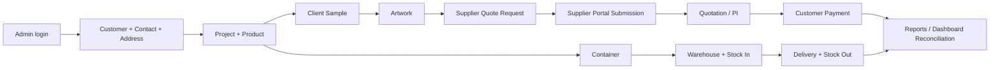

# Playwright Realistic Local E2E Test Plan — แผนทดสอบระบบเสมือนจริงบนเครื่อง Local

สถานะเอกสาร: Implementation-ready + โฟลว์หลักผ่านการรันจริงแล้ว  
ขอบเขต: `ppn_great` + `ppn-api` + `Supplier_ui_moocup`  
แหล่งวิเคราะห์: `implementation_plan.md`, แผน 14 วัน, แผน API integration, route/controller/schema ของ Laravel, Flutter screens และ Playwright specs ที่มีอยู่จริง

## 1. เป้าหมาย

ทดสอบเหมือนผู้ใช้จริงตั้งแต่ฐานข้อมูลว่าง โดยเริ่มจากตัวตนหลักเพียงสองตัว:

1. Administrator — อยู่ในตาราง `users`
2. Supplier — อยู่ในตาราง `suppliers` และเข้าสู่ Supplier Portal ด้วย session token ที่สร้างจาก Quote Request

ข้อสำคัญ: Supplier ไม่ใช่ user ในตาราง `users` ตามโครงสร้างระบบปัจจุบัน ดังนั้นคำว่า “สอง user” ในเชิงธุรกิจหมายถึงหนึ่ง Admin identity และหนึ่ง Supplier identity

ข้อมูลธุรกิจอื่นต้องเริ่มเป็นศูนย์ แล้วถูกสร้างผ่าน UI ตามลำดับจริง ห้ามใช้ seeder เติม Customer/Project/Finance/Inventory เพื่อทำให้เทสผ่าน และห้ามใช้ API สร้าง fixture แทนผู้ใช้ การเรียก API ใน test flow อนุญาตเฉพาะอ่านกลับเพื่อตรวจสอบ ID, relation, status และจำนวนเงิน

## 2. หลักการรันและความปลอดภัย

- Local เท่านั้น (`APP_ENV=local`)
- ใช้ฐานข้อมูลเฉพาะชื่อ `ppn_e2e`; ไม่ใช้ `ppn_staging` และไม่ใช้ฐานข้อมูลงานจริง
- ต้องยืนยันการล้างข้อมูลด้วย `-ConfirmReset`
- Laravel command ต้องผ่าน guard 4 ชั้น: local environment, allow-reset flag, exact database name และ allowlist
- ใช้ `migrate:fresh` ก่อน full-flow ทุกครั้ง เพื่อให้ผลทำซ้ำได้
- ใช้ worker เดียว เพราะข้อมูลทุกโมดูลอ้างอิงผลจากขั้นก่อนหน้า
- retries = 0 เพื่อไม่สร้างข้อมูลซ้ำและไม่กลบ defect
- บันทึก video, trace และ screenshot ตลอดทุกการรัน
- อัปโหลดไฟล์ด้วย Playwright `filechooser` ซึ่ง intercept `<input type="file">`; ไม่ automate หน้าต่างเลือกไฟล์ของ Windows

คำสั่ง reset จะไม่สร้างฐานข้อมูล MySQL ให้เอง ฐานข้อมูล `ppn_e2e` ต้องถูกสร้างไว้ก่อน และ user ของ Laravel ต้องมีสิทธิ์เฉพาะฐานนี้

## 3. Baseline หลัง Reset

| Entity / ตาราง | จำนวน | เงื่อนไข |
|---|---:|---|
| users | 1 | `admin@ppngreat.com`, role Admin |
| suppliers | 1 | `supplier@ppngreat.local`, active |
| customers | 0 | สร้างผ่าน UI |
| projects / product_items | 0 | สร้างหลัง Customer |
| samples / artworks | 0 | สร้างหลัง Project/Product |
| quote_requests | 0 | Admin สร้างและ generate token ผ่าน UI |
| finance_documents / payments | 0 | สร้างตามลำดับ QU/PI/Payment/CI |
| warehouses / inventory | 0 | Warehouse แรกสร้างผ่าน UI |
| containers / deliveries | 0 | สร้างหลังมี Project และ stock |

บัญชี default สามารถ override ด้วย environment variables ได้ แต่ค่าใน frontend, API seeder และ Playwright ต้องตรงกัน

## 4. Data Dependency Chain



หากขั้นใดล้มเหลว ขั้น downstream ต้องหยุด ไม่สร้างข้อมูลชดเชยผ่าน API เพราะจะทำให้วิดีโอและผลทดสอบไม่สะท้อนการใช้งานจริง

## 5. รูปแบบชื่อที่เห็นตอนรัน

ทุก suite, test และ `test.step` ใช้รูปแบบ:

```text
<CASE-ID> | <English description> | <คำอธิบายภาษาไทย>
```

ตัวอย่าง:

```text
REAL-001 | Complete realistic business cycle | วงจรธุรกิจเสมือนจริงครบกระบวนการ
CUST-001 | Create a customer with contact and billing address | สร้างลูกค้าพร้อมผู้ติดต่อและที่อยู่ออกบิล
```

ชื่อภาษาไทยจะแสดงใน terminal, HTML report, trace viewer และชื่อ test ภายใน video attachment metadata

## 6. Full-flow ที่ติดตั้งแล้ว

ไฟล์ `e2e/realistic/realistic-business-cycle.spec.ts` ทำงานต่อเนื่องดังนี้:

1. `PRE-001` ตรวจว่า Customer/Project เป็นศูนย์ และ Supplier มีหนึ่งราย
2. `AUTH-001` Admin login ผ่านหน้า Flutter
3. `CUST-001` สร้าง Customer + Contact + Billing/Shipping ผ่าน UI
4. `PROJ-001` สร้าง Project + Product ที่อ้าง Customer/Contact เดิม
5. `SAMP-001` บันทึก Sample และเปลี่ยนเป็น Approved by Client
6. `ART-001` กด Choose File, intercept file input, upload PNG และ approve
7. `SUP-001` สร้าง Quote Request และ generate Supplier Session Link
8. `PORTAL-001` Supplier login ด้วย token จริงและ submit ราคา
9. `VERIFY-001` Admin กลับมาตรวจ quote ที่ supplier ตอบ
10. `AUTH-002` Logout

API ถูกใช้เป็น read-only oracle หลังการกด UI เพื่อยืนยัน relation และสถานะ เช่น `project.customer_id`, sample status, artwork status, quote token และ `Price Filled`

## 7. Master Test Catalog — 142 Cases

รายการนี้คง coverage จากแผนต้นฉบับ แต่ปรับ prerequisite ให้สร้างจากวงจรข้อมูลจริง

### Suite 01 — Authentication (8)

- `TC-LOGIN-001` Valid admin login | เข้าสู่ระบบแอดมินสำเร็จ
- `TC-LOGIN-002` Wrong password | รหัสผ่านผิด
- `TC-LOGIN-003` Unknown email | อีเมลไม่มีในระบบ
- `TC-LOGIN-004` Empty required fields | ไม่กรอกข้อมูลบังคับ
- `TC-LOGIN-005` Show/hide password | แสดง/ซ่อนรหัสผ่าน
- `TC-LOGIN-006` Submit with Enter | กด Enter เพื่อเข้าสู่ระบบ
- `TC-LOGIN-007` Loading and double-submit protection | ตรวจ loading และป้องกันส่งซ้ำ
- `TC-LOGIN-008` Logout and token removal | ออกจากระบบและลบ token

### Suite 02 — Global Navigation (14)

- `TC-NAV-001..012` Open Dashboard, Projects, Samples, Artwork, Containers, Delivery, Customers, Suppliers, Finance, Inventory, Reports and Create Project | เปิดทุกเมนูและตรวจหัวหน้าจอ
- `TC-NAV-013` Logout confirmation | กล่องยืนยันออกจากระบบ
- `TC-NAV-014` Back from child screen | กลับ Dashboard จากหน้าย่อย

ทุกกรณีต้องตรวจ pageerror, console error, failed API และ Flutter white-screen/crash

### Suite 03 — Customers (12)

- `TC-CUST-001` Empty state/list API | หน้าเริ่มต้นและรายการลูกค้า
- `TC-CUST-002` Search by name | ค้นหาด้วยชื่อ
- `TC-CUST-003` Detail and statistics | รายละเอียดและสถิติ
- `TC-CUST-004` Create happy path | สร้างลูกค้าสำเร็จ
- `TC-CUST-005` Multiple contacts | ผู้ติดต่อหลายคน
- `TC-CUST-006` Multiple shipping addresses | ที่อยู่จัดส่งหลายแห่ง
- `TC-CUST-007` Required-name validation | ไม่กรอกชื่อบริษัท
- `TC-CUST-008` Collapse/expand customer sidebar | ย่อ/ขยาย sidebar
- `TC-CUST-009` Edit customer | แก้ไขข้อมูลลูกค้า
- `TC-CUST-010` Remove secondary contact | ลบผู้ติดต่อรอง
- `TC-CUST-011` Open customer's project | เปิดโปรเจกต์ของลูกค้า
- `TC-CUST-012` Create project from customer | สร้างโปรเจกต์จากหน้าลูกค้า

### Suite 04 — Projects (10)

- `TC-PROJ-001` List generated project code | แสดงรหัสโปรเจกต์ที่ระบบสร้าง
- `TC-PROJ-002` Search project code | ค้นหาด้วยรหัส
- `TC-PROJ-003` Status filter | กรองสถานะ
- `TC-PROJ-004` Project/product/finance detail | รายละเอียดโครงการ สินค้า และการเงิน
- `TC-PROJ-005` Pipeline transition | เปลี่ยนสถานะตาม pipeline
- `TC-PROJ-006` Create project and auto code | สร้างโครงการและรหัสอัตโนมัติ
- `TC-PROJ-007` Missing customer validation | ไม่เลือกลูกค้า
- `TC-PROJ-008` Activity log | ประวัติกิจกรรม
- `TC-PROJ-009` Add product | เพิ่มสินค้า
- `TC-PROJ-010` Edit project/product terms | แก้ไขโครงการและเงื่อนไข

### Suite 05 — Client Samples (10)

- `TC-SAMP-001` Project/sample list | โหลดโครงการและตัวอย่าง
- `TC-SAMP-002` Create attempt 1 | สร้างตัวอย่างครั้งแรก
- `TC-SAMP-003` Happy status pipeline | Waiting → Received → Sent → Delivered → Approved
- `TC-SAMP-004` Reject with feedback | ปฏิเสธพร้อม feedback
- `TC-SAMP-005` Create attempt 2 after rejection | สร้างครั้งที่สองหลังถูกปฏิเสธ
- `TC-SAMP-006` Edit China tracking | แก้ tracking จากจีน
- `TC-SAMP-007` Edit local courier/tracking | แก้ courier/tracking ในประเทศ
- `TC-SAMP-008` Missing project validation | ไม่ระบุโครงการ
- `TC-SAMP-009` Missing sample type validation | ไม่เลือกประเภทตัวอย่าง
- `TC-SAMP-010` UI/API/database field match | ข้อมูลหน้าจอตรงกับข้อมูลที่บันทึก

### Suite 06 — Artwork (10)

- `TC-ART-001` Project/artwork list | โหลดโครงการและอาร์ตเวิร์ก
- `TC-ART-002` Upload V1 | อัปโหลด V1 ผ่าน file input
- `TC-ART-003` Approve pipeline | Awaiting → Reviewing → Approved by Client
- `TC-ART-004` Need revision with feedback | ขอแก้ไขพร้อม feedback
- `TC-ART-005` Upload V2/attempt 2 | อัปโหลด V2
- `TC-ART-006` Supplier approval | อนุมัติโดย supplier
- `TC-ART-007` Feedback history | ประวัติ feedback
- `TC-ART-008` Edit filename | แก้ชื่อไฟล์
- `TC-ART-009` Missing project validation | ไม่เลือกโครงการ
- `TC-ART-010` Preview without 403/CORS | เปิด preview ได้

### Suite 07 — Dashboard (6)

- `TC-DASH-001` KPI reconciliation | KPI ตรงกับข้อมูลที่สร้าง
- `TC-DASH-002` Recent activities | กิจกรรมล่าสุด
- `TC-DASH-003` Cash-flow chart render | กราฟกระแสเงินสด
- `TC-DASH-004` Active projects by stage | จำนวนโครงการตามขั้นตอน
- `TC-DASH-005` New Project quick action | ปุ่มสร้างโครงการ
- `TC-DASH-006` Reload persistence | รีโหลดแล้วยังทำงาน

### Suite 08 — Suppliers (14)

- `TC-SUP-001` Baseline supplier | supplier ตั้งต้นหนึ่งราย
- `TC-SUP-002` Create supplier | สร้าง supplier เพิ่ม
- `TC-SUP-003` Search supplier | ค้นหาโรงงาน
- `TC-SUP-004` Quote request for project/product | ขอราคาโดยอ้างโครงการ/สินค้า
- `TC-SUP-005` Generate session link | สร้าง token/link
- `TC-SUP-006` Copy link | คัดลอกลิงก์
- `TC-SUP-007` Review/approve quote | ตรวจและอนุมัติราคา
- `TC-SUP-008` Request supplier sample | ขอตัวอย่างจาก supplier
- `TC-SUP-009` Supplier sample status | เปลี่ยนสถานะตัวอย่าง
- `TC-SUP-010` Create supplier bill | สร้างบิล supplier
- `TC-SUP-011` Mark bill paid | บันทึกว่าจ่ายแล้ว
- `TC-SUP-012` Upload bill attachment | อัปโหลดเอกสารแนบ
- `TC-SUP-013` Quote without project | validation เมื่อไม่ระบุโครงการ
- `TC-SUP-014` Negative bill amount | ปฏิเสธยอดติดลบ

### Suite 09 — Finance Documents (9)

- `TC-FIN-001` Empty/list documents | สถานะว่างและรายการเอกสาร
- `TC-FIN-002` Create Quotation | สร้าง QU และเลขอัตโนมัติ
- `TC-FIN-003` Create PI from project | สร้าง PI จากโครงการ
- `TC-FIN-004` Items/subtotal/tax/total detail | ตรวจรายการและยอดรวม
- `TC-FIN-005` Draft to Sent | เปลี่ยน Draft เป็น Sent
- `TC-FIN-006` Due-date calculation | คำนวณวันครบกำหนด
- `TC-FIN-007` Document-type filters | กรองประเภทเอกสาร
- `TC-FIN-008` Missing project validation | ไม่ระบุโครงการ
- `TC-FIN-009` Edit draft | แก้เอกสาร Draft

### Suite 10 — Payments (7)

- `TC-PAY-001` Empty/list payments | สถานะว่างและรายการรับเงิน
- `TC-PAY-002` Record project payment | รับเงินโดยอ้างโครงการ
- `TC-PAY-003` Upload payment slip | อัปโหลดสลิปด้วย file input
- `TC-PAY-004` Verify payment | ยืนยันการรับเงิน
- `TC-PAY-005` Slip preview | เปิดดูสลิป
- `TC-PAY-006` Invalid file type | ปฏิเสธชนิดไฟล์ผิด
- `TC-PAY-007` Negative amount | ปฏิเสธยอดติดลบ

### Suite 11 — Containers (7)

- `TC-CONT-001` Empty/list containers | สถานะว่างและรายการตู้
- `TC-CONT-002` Create and link project | สร้างตู้และเชื่อมโครงการ
- `TC-CONT-003` Step 1 to Sailing | เปลี่ยนเป็น Sailing
- `TC-CONT-004` Sailing to Port/Warehouse | เปลี่ยนเป็น Port/Warehouse
- `TC-CONT-005` Linked-project detail | ตรวจโครงการในตู้
- `TC-CONT-006` Edit tracking/ETD/ETA | แก้ tracking และวันที่
- `TC-CONT-007` Required-date validation | ไม่กรอกวันที่บังคับ

### Suite 12 — Inventory (7)

- `TC-INV-001` Empty warehouse state | สถานะยังไม่มีคลัง
- `TC-INV-002` Create warehouse | เพิ่มคลังแรกผ่าน UI
- `TC-INV-003` Product stock list | แสดงสินค้าในสต็อก
- `TC-INV-004` Stock in | รับเข้าและ movement = IN
- `TC-INV-005` Manual adjustment | ปรับยอดและ movement = ADJUST
- `TC-INV-006` Movement history | ประวัติ IN/OUT/ADJUST
- `TC-INV-007` Multiple warehouse tabs | สลับคลังและข้อมูลแยกกัน

### Suite 13 — Delivery (8)

- `TC-DEL-001` Empty/list rounds | สถานะว่างและรายการรอบส่ง
- `TC-DEL-002` Create driver/vehicle/items round | สร้างรอบพร้อมคนขับ รถ และสินค้า
- `TC-DEL-003` Confirm departure decrements stock | ยืนยันออกส่งแล้วสต็อกลด
- `TC-DEL-004` OUT movement exact quantity | movement OUT ตรงจำนวน
- `TC-DEL-005` Complete delivery | ปิดงาน Delivered
- `TC-DEL-006` Insufficient stock atomic failure | สต็อกไม่พอและห้ามตัดบางส่วน
- `TC-DEL-007` Double-confirm idempotency | กดยืนยันซ้ำไม่ตัดซ้ำ
- `TC-DEL-008` Direct shipped does not affect warehouse | ส่งตรงไม่ตัดคลัง

### Suite 14 — Reports (8)

- `TC-RPT-001` Open without Flutter crash | เปิดโดยไม่จอขาว
- `TC-RPT-002` Revenue matches payments | รายได้ตรง payment
- `TC-RPT-003` Profitability by project | กำไรตามโครงการ
- `TC-RPT-004` Cash-flow totals | ยอดกระแสเงินสด
- `TC-RPT-005` Tax analytics | วิเคราะห์ภาษี
- `TC-RPT-006` Delivery schedule | ตารางจัดส่ง
- `TC-RPT-007` Period filter | กรองช่วงเวลา
- `TC-RPT-008` Customer portfolio | สัดส่วนลูกค้า

### Suite 15 — Supplier Portal (10)

- `TC-SP-001` Login with generated token | เข้าด้วย token ที่สร้างจริง
- `TC-SP-002` Invalid token | token ผิด
- `TC-SP-003` Pending quote card | การ์ดราคาที่ยังรอ
- `TC-SP-004` Submit quote | ส่งราคาและ lead time
- `TC-SP-005` Missing price validation | ไม่กรอกราคา
- `TC-SP-006` Missing lead-time validation | ไม่กรอก lead time
- `TC-SP-007` Pending/history tabs | สลับแท็บ
- `TC-SP-008` Submitted quote in history | ราคาอยู่ในประวัติ
- `TC-SP-009` Submit revision | แก้ไขและส่งราคาใหม่
- `TC-SP-010` Logout | ออกจาก Portal

### Suite 16 — Cross-module Flows (2)

- `TC-FLOW-001` Full business cycle | Customer → Project → Sample → Artwork → Supplier → Finance → Container → Inventory → Delivery → Reports
- `TC-FLOW-002` Stock integrity | Stock In → Delivery OUT → duplicate confirm → remaining balance and movement reconciliation

## 8. Assertion Strategy

แต่ละ action ต้องมี assertion อย่างน้อยสามชั้น:

1. UI feedback — dialog/snackbar/status/card ที่ผู้ใช้เห็น
2. API state — response จาก GET หลัง action ต้องมี relation/status/value ที่ถูกต้อง
3. Cross-module reconciliation — จำนวนเดียวกันต้องตรงกันในหน้าที่เกี่ยวข้อง เช่น PI total = Payment reference, Delivery quantity = Inventory OUT, Report revenue = confirmed payment

กรณีการเงินและ stock ต้องตรวจ exact-once/idempotency เพิ่มเติม และต้องทดสอบ failure ก่อน success เมื่อมีความเสี่ยงตัดยอดซ้ำ

## 9. Video, Trace และ Report

ผลลัพธ์หลังรัน:

- Video: `test-results-realistic/**/video.webm`
- Trace: `test-results-realistic/**/trace.zip`
- Screenshots: อยู่ใน test result directory เดียวกัน
- HTML report: `playwright-report-realistic/index.html`
- JUnit: `test-results-realistic/junit.xml`

หนึ่ง full-flow test จะได้วิดีโอต่อเนื่องหนึ่งไฟล์ เห็นข้อมูลค่อย ๆ ถูกสร้างตามลำดับ หากแยก 142 atomic tests จะได้วิดีโอแยกต่อ test และต้องใช้ fixture/state strategy เพิ่มเพื่อไม่ให้แต่ละ test แย่งกันล้างฐานข้อมูล

## 10. วิธีรันทั้งหมดพร้อมวิดีโอ

เตรียม MySQL database ชื่อ `ppn_e2e` ก่อน จากนั้นเปิด PowerShell ที่ `D:\07_Projects\Work\PNN\ppn_great` แล้วรัน:

```powershell
.\scripts\run-realistic-e2e-video.ps1 -ConfirmReset
```

คำสั่งแบบ environment variables โดยตรง:

```powershell
$env:APP_ENV='local'
$env:DB_DATABASE='ppn_e2e'
$env:E2E_RESET_DATABASE='ppn_e2e'
$env:E2E_ALLOWED_RESET_DATABASES='ppn_e2e'
$env:E2E_ALLOW_DATABASE_RESET='1'
$env:E2E_API_URL='http://127.0.0.1:8001'
$env:E2E_ADMIN_URL='http://127.0.0.1:4174'
$env:E2E_SUPPLIER_URL='http://localhost:3001'
$env:PPN_API_BASE_URL='http://127.0.0.1:8001/api'
npm run build:web:realistic
npm run e2e:realistic:video
```

เปิดรายงาน:

```powershell
npm run e2e:realistic:report
```

ดูรายชื่อ test โดยไม่ล้างฐานข้อมูล:

```powershell
npm run e2e:realistic:list
```

## 11. Implementation Phases

1. Foundation — baseline seeder, reset guard, bilingual naming, video config, file chooser helper
2. Core CRM flow — Customer, Project, Sample, Artwork
3. Supplier cross-system flow — Quote, token, Portal submit, Admin review
4. Finance flow — QU/PI, slip upload, payment verify, CI and arithmetic reconciliation
5. Logistics flow — Container, Warehouse, Stock In, Delivery, exact-once Stock Out
6. Reporting flow — Dashboard and Reports reconcile against records created in phases 2–5
7. Negative/validation matrix — invalid credentials, required fields, file types, negative amounts, insufficient stock, duplicate confirm
8. Stabilization — remove arbitrary sleeps, use API-idle/event waits, classify known product defects separately from flaky automation

Foundation, core flow, Supplier Portal, finance, logistics, inventory, delivery และ reports ถูกติดตั้งเป็น flow ต่อเนื่องแล้ว และผ่านการรัน Full Reset จริงบนฐาน `ppn_e2e` เมื่อ 18 กรกฎาคม 2026 (`1 passed`, test 5.2 นาที, รวม runner 5.5 นาที)

## 12. Known Risks Found from Real Files

- Supplier Portal authentication model ไม่ใช่ Laravel user model; token เกิดหลัง generate quote link
- Endpoint submit quote ของ Portal ควรตรวจ token/session ฝั่ง backend ทุกครั้ง; test security ต้องคงไว้เป็น known defect จนแก้ authorization
- หน้า Add Local Sample ส่ง payload status `Sent to Client` แต่ backend `ClientSampleController::store` ไม่ใช้ field นี้และบังคับ In-Stock เป็น `Received from China`; realistic test จึงต้องเปลี่ยนสถานะผ่าน UI ต่ออีกหนึ่งขั้น
- Flutter semantics บาง control ใช้ hint เป็น accessible name ไม่ใช่ label; locator ต้องตรวจจาก DOM build ปัจจุบัน
- การทดสอบบน prebuilt `build/web` ต้อง build ใหม่เมื่อแก้ Dart source
- Full flow เป็น destructive test และไม่ควรรันกับ `ppn_staging`
- การสร้าง warehouse จาก baseline ว่างต่างจาก plan เดิมที่คาดว่ามีคลังจาก seeder; catalog ฉบับนี้ปรับให้สร้างคลังผ่าน UI ตามวัตถุประสงค์ใหม่แล้ว

## 13. Installed Complete Business Flow — Flow ที่ติดตั้งครบแล้ว

ลำดับที่รันจริงใน `REAL-001` และชื่อ step ในรายงานเป็นภาษาอังกฤษ/ไทยคู่กัน:

1. `PRE-001` Clean baseline | ตรวจฐานเริ่มต้นหลัง reset
2. `AUTH-001` Admin sign-in | แอดมินเข้าสู่ระบบ
3. `CUST-001` Customer/contact/address | สร้างลูกค้า ผู้ติดต่อ และที่อยู่
4. `PROJ-001` Project/product | สร้างโครงการและสินค้า 1,000 ชิ้น
5. `SAMP-001` Client sample | บันทึก ส่ง และอนุมัติตัวอย่าง
6. `ART-001` Artwork upload/approval | อัปโหลดด้วย file chooser และอนุมัติอาร์ตเวิร์ก
7. `SUP-001` Quote request/session | ขอราคาและสร้าง supplier session token
8. `PORTAL-001` Supplier quote | ซัพพลายเออร์ login และกรอกใบเสนอราคาจริง
9. `PROC-001` Quote approval | แอดมินอนุมัติราคาโรงงาน
10. `INV-001` Warehouse | สร้างคลังสินค้าใหม่ผ่าน UI
11. `AP-001` Supplier deposit | สร้างบิลมัดจำ อัปโหลด PI/Invoice และจ่าย
12. `AR-001` QU/PI + customer deposit | ออก QU/PI รับสลิป และยืนยันเงินมัดจำลูกค้า
13. `LOG-001` Container lifecycle | สร้างตู้และเลื่อน Factory to Port → Sailing → Port to Warehouse → Delivered
14. `INV-002` Container stock-in | รับสินค้า 1,000 ชิ้นเข้าโกดังและห้ามรับซ้ำ
15. `DEL-001` Customer delivery | จอง 900 ชิ้น ออกรถ ตัดสต๊อก และ Delivered
16. `AP-002` Supplier balance | อัปโหลดเอกสารและจ่ายยอดคงเหลือโรงงาน
17. `AR-002` Customer balance | รับยอดคงเหลือ 99,000 บาทและยืนยันครบ 149,000 บาท
18. `AR-003` Commercial Invoice | ออก CI
19. `RPT-001` Reconciliation/report | ตรวจสต๊อกเหลือ 100, movement exact-once, เอกสารและยอดรับจ่าย
20. `AUTH-002` Logout | ออกจากระบบ

Business invariants ที่ test บังคับ:

- Container รับเข้าได้เมื่อ `Delivered` เท่านั้น
- Routing quantity รวมต้องเท่ากับจำนวนรับจริง
- Container เดียวกัน + project + product ห้าม stock-in ซ้ำ
- Delivery 900 จาก 1,000 ต้องเหลือ 100 และมี OUT movement หนึ่งรายการ
- Delivery confirmation ซ้ำต้องไม่ตัดสต๊อกซ้ำ
- Supplier bills ต้องมี Deposit + Balance และทั้งสองเป็น `Paid`
- Customer payments ต้องมี Deposit 50,000 + Full 99,000 และทั้งสองเป็น `Confirmed`
- PI จะเป็น `Paid` ต่อเมื่อยอด confirmed สะสมถึง total 149,000 ไม่ใช่หลังรับมัดจำบางส่วน
- QU, PI และ CI ต้องออกจาก UI และไม่ค้าง `Draft`

## 14. Fast Iteration / Resume Mode — โหมดทำงานต่อเพื่อแก้เทสเร็ว

Full Reset ใช้สำหรับหลักฐานสุดท้ายและ CI แบบ destructive:

```powershell
.\scripts\run-realistic-e2e-video.ps1 -ConfirmReset
```

ข้าม build เมื่อ build ปัจจุบันตรงกับ source:

```powershell
.\scripts\run-realistic-e2e-video.ps1 -ConfirmReset -SkipBuild
```

ทำงานต่อจากข้อมูลใน `ppn_e2e` โดยไม่ reset และไม่ทำขั้นที่สำเร็จแล้วซ้ำ:

```powershell
.\scripts\run-realistic-e2e-video.ps1 -Resume -SkipBuild
```

Resume flow อ่าน state จริงจาก API แล้วหา project/supplier/quote/warehouse/container/bills/documents/payments/movements ที่มีอยู่ จึงเหมาะกับการไล่แก้ selector ทีละจุด หลังข้อมูลครบ รอบที่ยืนยันล่าสุดใช้เวลา 22.9 วินาที; ถ้าค้างกลาง logistics ระยะเวลาจะมากขึ้นตามงานที่ยังเหลือ

## 15. Selector and Accessibility Strategy — กลยุทธ์ selector ที่ใช้จริง

ลำดับความสำคัญ:

1. `getByRole(..., { name })` จาก accessible name ที่ผู้ใช้เข้าใจ
2. `getByLabel(...)` หรือ `InputDecoration.labelText` สำหรับ input ตัวจริง
3. `getByText(...)` เฉพาะข้อความเนื้อหาที่ไม่ใช่ control
4. CSS/id ใช้กับ Supplier Portal HTML ที่มี id เป็น contract ชัดเจน

สิ่งที่แก้เพื่อกำจัด timeout/flakiness:

- ย้ายชื่อ finance/payment field ไปที่ `TextFormField` ตัวจริง แทน `Semantics` ซ้อนที่สร้าง textbox disabled
- ใช้ Flutter `Checkbox` จริงสำหรับ supplier bills และใช้ role `checkbox`
- ใช้ role `checkbox` สำหรับ project ใน create-container dialog
- ใส่ label เฉพาะให้ product/warehouse/quantity ใน Delivery
- ใส่ tooltip/accessibility name ให้ date picker ทุกช่อง และตรวจว่าปุ่มแสดง `dd/mm/yyyy` ก่อนทำ action ต่อ
- เลือก Sample/Artwork status ด้วยชื่อ `menuitem` จริง ไม่ใช้ `ArrowDown` ตามลำดับ
- ใช้ API polling เป็น postcondition หลัง mutation แทน arbitrary sleep

`agent-browser` CLI เวอร์ชัน 0.27.0 ถูกติดตั้งและใช้ผ่าน CDP กับ Chromium ของ Playwright เพื่อดู Flutter accessibility tree แบบเร็ว ช่วยค้นพบ nested semantics และชื่อ role ที่ผิด ส่วน runtime Chromium ของ agent-browser เองดาวน์โหลดไม่สำเร็จจาก network timeout จึงใช้ runtime Playwright ที่มีอยู่แทน

## 16. MCP / Kubernetes / Cluster Assessment

- ใน environment ปัจจุบันไม่มี Playwright MCP, Kubernetes MCP หรือ Cluster MCP ที่ติดตั้งและ callable
- ไม่มี MCP resource/template สำหรับ cluster ใน workspace นี้
- ใน ecosystem มี `containers/kubernetes-mcp-server` ซึ่งรองรับ Kubernetes/OpenShift, multi-cluster และเชื่อม Kubernetes API โดยตรง แต่ต้องมีสิทธิ์เข้าถึง cluster/kubeconfig: https://github.com/containers/kubernetes-mcp-server
- Kubernetes/Cluster MCP มีประโยชน์เมื่อระบบรันบน cluster และต้องตรวจ pods, deployments, services, ingress, logs หรือ rollout เท่านั้น
- งานนี้กำหนด `local only` และ stack เป็น Flutter Web + Laravel + MySQL local ดังนั้น Kubernetes MCP ไม่ได้แก้ selector หรือความเร็ว Playwright และไม่ควรนำ kubeconfig/cluster credential เข้ามาโดยไม่มี cluster อยู่ใน scope
- เครื่องมือที่ตรงปัญหาคือ accessibility snapshot + Playwright trace/video + Resume checkpoint ซึ่งถูกนำมาใช้แล้ว

ผลยืนยันล่าสุด:

- Full Reset: `1 passed`, test 5.2 นาที, รวม 5.5 นาที
- Video: `test-results-realistic/**/video.webm` (ประมาณ 11.65 MB)
- Trace: `test-results-realistic/**/trace.zip` (ประมาณ 109 MB)
- HTML report: `playwright-report-realistic/index.html`
- TypeScript: `npx tsc --noEmit` ผ่าน
- Flutter: build web ผ่าน; targeted analyze ไม่มี compile error แต่ยังมี warning/info เดิมของโปรเจกต์
